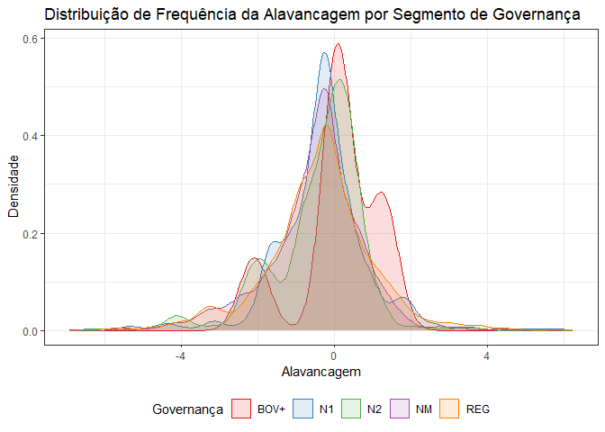
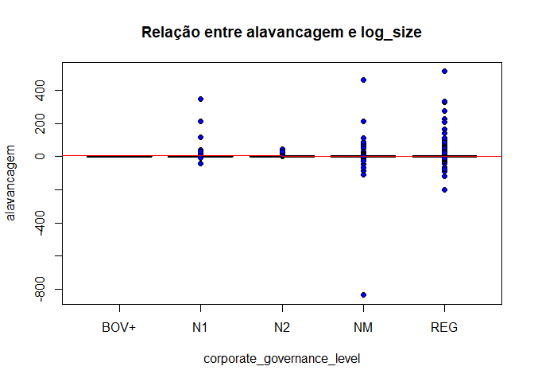
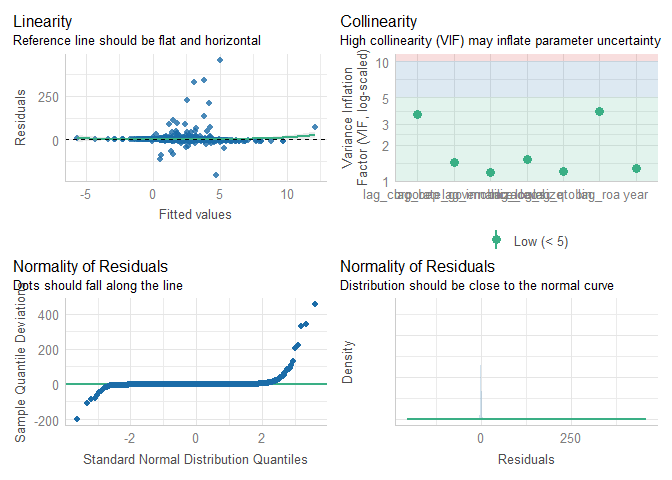
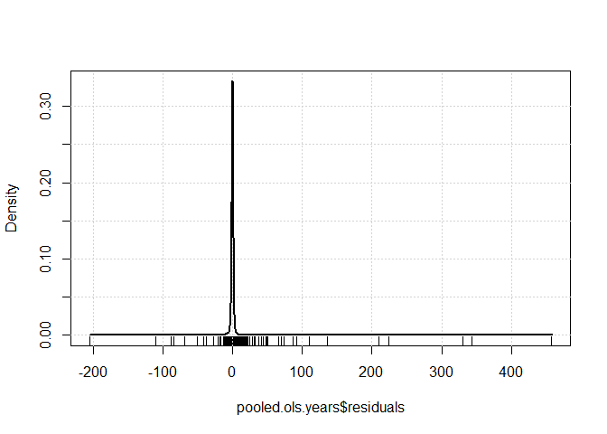

``` r
df.raw <- read_xlsx(here("econometria/data/base_2024.xlsx"))
```


``` r
# 3. WRANGLING DATA ----

## Select variables ----
df <- df.raw %>%
  select(year,
         quarter,
         companyname, 
         setor_economia,
         corporate_governance_level,
         total_asset,
         permanent_asset,
         short_term_debt,
         long_term_debt,
         patrimonio_liquido,
         ebit,
         net_profit,
         firm_market_value
)

## Cleaning ----

## Se o YEAR is NA, excluir
df <- df %>%
  filter(!is.na(year))

## Excluir o ano de 2014 pois só tem o 1º trimestre
df <- df %>%
  filter(year != 2014)

# Excluir dados ausentes da variavel governanca
df <- df |> 
  filter(corporate_governance_level != "NDISPO")

# Excluir dados sem valor de `patrimonio_liquido`
df <- df |> 
  filter(patrimonio_liquido != 0)

# Excluir empresas financeiras
df <- df |> 
  filter(setor_economia != "Finanças e Seguros")


# Excluir observações onde tanto `short_term_debt` quanto `long_term_debt` são NA
df <- df[!(is.na(df$short_term_debt) & is.na(df$long_term_debt)), ]

# Substituir NAs por zero nas variáveis `short_term_debt` e `long_term_debt`
df$short_term_debt[is.na(df$short_term_debt)] <- 0
df$long_term_debt[is.na(df$long_term_debt)] <- 0


## Trimming ----
# Função para identificar observações com valores extremos e excluir estas observações
exclude_extreme_values <- function(data, variables, probs = c(0.05, 0.95)) {
  extreme_indices <- sapply(variables, function(var) {
    x <- data[[var]]
    lower_bound <- quantile(x, probs[1], na.rm = TRUE)
    upper_bound <- quantile(x, probs[2], na.rm = TRUE)
    (x < lower_bound | x > upper_bound) & !is.na(x)
  })
  # Combina as condições de todas as variáveis para identificar linhas extremas
  extreme_rows <- apply(extreme_indices, 1, any)
  return(data[!extreme_rows, ])
}

# Lista de variáveis para verificar valores extremos
variables_to_check <- c(
  "total_asset",
  "permanent_asset",
  "short_term_debt",
  "long_term_debt",
  "patrimonio_liquido",
  "ebit",
  "net_profit",
  "firm_market_value"
)
# Aplicar a função para excluir observações com valores extremos
df <- exclude_extreme_values(df, variables_to_check)


## Create new variables ----
df <- df  |> 
  mutate(
    alavancagem = (short_term_debt + long_term_debt) / patrimonio_liquido,
    imobilizacao = (permanent_asset / total_asset),  
    roa = (net_profit / total_asset),
    qtobin = (firm_market_value / total_asset),
    bep = (ebit / total_asset),
    log_size = log(total_asset)
  )


## Transformar em factor ----
df <- df |> 
  mutate(across(c(setor_economia, corporate_governance_level, year, quarter), as.factor))


## Organize variables ----
df <- df |> 
  select(year,
         quarter,
         companyname, 
         setor_economia,
         alavancagem,
         corporate_governance_level,
         imobilizacao,
         roa,
         qtobin,
         bep,
         log_size,
         total_asset
  )


# 4. CREATE pdata.frame ----

pdata <- pdata.frame(df, index = c("companyname", "year", "quarter"))
```

```
## Warning in pdata.frame(df, index = c("companyname", "year", "quarter")): duplicate couples (id-time) in resulting pdata.frame
##  to find out which, use, e.g., table(index(your_pdataframe), useNA = "ifany")
```

``` r
## Criar lags das variáveis independentes ----
pdata$lag_corporate_governance_level <- lag(pdata$corporate_governance_level, k = 1)
pdata$lag_imobilizacao <- lag(pdata$imobilizacao, k = 1)
pdata$lag_roa <- lag(pdata$roa, k = 1)
pdata$lag_qtobin <- lag(pdata$qtobin, k = 1)
pdata$lag_bep <- lag(pdata$bep, k = 1)
pdata$lag_log_size <- lag(pdata$log_size, k = 1)
pdata$lag_total_asset <- lag(pdata$total_asset, k = 1)
```


``` r
# 3. WRANGLING DATA ----

# Select variables ----
dfcs <-  df.raw |> 
  select(companyname, 
         setor_economia,
         corporate_governance_level,
         total_asset,
         permanent_asset,
         short_term_debt,
         long_term_debt,
         patrimonio_liquido,
         ebit,
         net_profit,
         firm_market_value,
         quarter,
         year)

## Cleaning ----
## Se o YEAR is NA, excluir
dfcs <- dfcs %>%
  filter(!is.na(year))

## Excluir o ano de 2014 pois só tem o 1º trimestre
dfcs <- dfcs %>%
  filter(year != 2014)

## Excluir os trimestres intermediarios 1 a 3
dfcs <- dfcs |> 
  filter(quarter == 4) |> 
  select(-quarter)


# Excluir dados ausentes da variavel governanca
dfcs <- dfcs |> 
  filter(corporate_governance_level != "NDISPO")

# Excluir dados sem valor de `equity`
dfcs <- dfcs |> 
  filter(patrimonio_liquido != 0)

# Excluir empresas financeiras
dfcs <- dfcs |> 
  filter(setor_economia != "Finanças e Seguros")


# Trimming ----
# Função para identificar observações com valores extremos e excluir estas observações
exclude_extreme_values <- function(data, variables, probs = c(0.05, 0.95)) {
  extreme_indices <- sapply(variables, function(var) {
    x <- data[[var]]
    lower_bound <- quantile(x, probs[1], na.rm = TRUE)
    upper_bound <- quantile(x, probs[2], na.rm = TRUE)
    (x < lower_bound | x > upper_bound) & !is.na(x)
  })
  # Combina as condições de todas as variáveis para identificar linhas extremas
  extreme_rows <- apply(extreme_indices, 1, any)
  return(data[!extreme_rows, ])
}

# Lista de variáveis para verificar valores extremos
variables_to_check <- c(
  "total_asset",
  "permanent_asset",
  "short_term_debt",
  "long_term_debt",
  "patrimonio_liquido",
  "ebit",
  "net_profit",
  "firm_market_value"
)
# Aplicar a função para excluir observações com valores extremos
dfcs <- exclude_extreme_values(dfcs, variables_to_check)

## Create new variables ----
dfcs <- dfcs  |> 
  mutate(
    alavancagem = (short_term_debt + long_term_debt) / patrimonio_liquido,
    imobilizacao = (permanent_asset / total_asset),  
    roa = (net_profit / total_asset),
    qtobin = (firm_market_value / total_asset),
    bep = (ebit / total_asset),
    log_size = log(total_asset)
  )

# Transformar em factor
dfcs <- dfcs |> 
  mutate(across(c(setor_economia, corporate_governance_level, year), as.factor))


# Criar data frames para cada ano ----
anos <- unique(dfcs$year)
for (ano in anos) {
  assign(paste0("df", ano), dfcs |>  
           filter(year == ano) |>  
           select(-year))
}
```


# 1. Introdução

Usamos dados em painel de empresas não financeiras do Brasil para testar, empiricamente, 
em qual medida a alavancagem se relaciona com a governança corporativa.  
Nos dados, aplicamos técnicas de regressão OLS para estimação.

*Hipotese* : O nivel de governança é positivamente associado à alavancagem.


# 2. Dados

Para testar nossa hipótese, construímos uma amostra que inicialmente contém todas as empresas 
não financeiras listadas na B3 ao longo de um período de 14 anos, de 2000 a 2013. 
Após excluir observações com dados-chave ausentes, temos uma amostra em painel desbalanceada de observações anuais de empresas não financeiras. 
Para minimizar outliers e possíveis erros de registro de dados, eliminamos os valores das variáveis que estavam fora dos limites dos percentis 5 e 95.


Os dados apresentam as seguintes características:


``` r
stargazer(pdata, type = "html")
```


<table style="text-align:center"><tr><td colspan="6" style="border-bottom: 1px solid black"></td></tr><tr><td style="text-align:left">Statistic</td><td>N</td><td>Mean</td><td>St. Dev.</td><td>Min</td><td>Max</td></tr>
<tr><td colspan="6" style="border-bottom: 1px solid black"></td></tr><tr><td style="text-align:left">alavancagem</td><td>7,590</td><td>1.659</td><td>16.871</td><td>-835.147</td><td>513.865</td></tr>
<tr><td style="text-align:left">imobilizacao</td><td>7,505</td><td>0.342</td><td>0.226</td><td>0.0003</td><td>1.000</td></tr>
<tr><td style="text-align:left">roa</td><td>7,588</td><td>0.021</td><td>0.062</td><td>-0.990</td><td>0.476</td></tr>
<tr><td style="text-align:left">qtobin</td><td>5,216</td><td>4.886</td><td>17.966</td><td>0.001</td><td>304.590</td></tr>
<tr><td style="text-align:left">bep</td><td>7,588</td><td>0.052</td><td>0.066</td><td>-0.458</td><td>0.674</td></tr>
<tr><td style="text-align:left">log_size</td><td>7,590</td><td>13.139</td><td>1.468</td><td>9.662</td><td>16.300</td></tr>
<tr><td style="text-align:left">total_asset</td><td>7,590</td><td>1,230,493.899</td><td>1,677,484.122</td><td>15,705</td><td>12,000,000</td></tr>
<tr><td style="text-align:left">lag_imobilizacao</td><td>5,027</td><td>0.344</td><td>0.227</td><td>0.0003</td><td>1.000</td></tr>
<tr><td style="text-align:left">lag_roa</td><td>5,084</td><td>0.016</td><td>0.046</td><td>-0.358</td><td>0.404</td></tr>
<tr><td style="text-align:left">lag_qtobin</td><td>3,516</td><td>4.810</td><td>17.578</td><td>0.001</td><td>304.590</td></tr>
<tr><td style="text-align:left">lag_bep</td><td>5,083</td><td>0.041</td><td>0.051</td><td>-0.384</td><td>0.530</td></tr>
<tr><td style="text-align:left">lag_log_size</td><td>5,085</td><td>13.139</td><td>1.429</td><td>9.666</td><td>16.213</td></tr>
<tr><td style="text-align:left">lag_total_asset</td><td>5,085</td><td>1,177,320.751</td><td>1,576,712.616</td><td>15,775</td><td>11,000,000</td></tr>
<tr><td colspan="6" style="border-bottom: 1px solid black"></td></tr></table>

É possível observar a alavancagem por nível de governança corporativa:


``` r
# Criar um histograma suave (density plot) para cada segmento de governança
ggplot(df, aes(x = log(alavancagem), color = factor(corporate_governance_level), fill = factor(corporate_governance_level))) +
  geom_density(alpha = 0.15) +
  scale_color_brewer(palette = "Set1") +
  scale_fill_brewer(palette = "Set1") +
  labs(title = "Distribuição de Frequência da Alavancagem por Segmento de Governança",
       x = "Alavancagem",
       y = "Densidade",
       color = "Governança",
       fill = "Governança") +
  theme_bw() +
  theme(legend.position = "bottom")
```

```
## Warning in log(alavancagem): NaNs produzidos
```

```
## Warning: Removed 392 rows containing non-finite outside the scale range
## (`stat_density()`).
```

<!-- -->

E também como:


``` r
# Relação entre alavancagem e corporate_govenance_level
plot(df$corporate_governance_level, df$alavancagem, 
     xlab = "corporate_governance_level", ylab = "alavancagem",
     main = "Relação entre alavancagem e log_size",
     pch = 21, bg = "blue")
abline(lm(alavancagem ~ log_size, data = df), col = "red")
```

<!-- -->

E por fim:


``` r
## Medias e Medianas ----
# Função para calcular resumos estatísticos
calculate_summary <- function(group_data) {
  summary_stats <- (summary(group_data$alavancagem))
  return(summary_stats)
}

# Aplicar a função a cada nível de corporate_governance_level e construir o dataframe
summary_table <- df %>%
  group_by(corporate_governance_level) %>%
  summarise(
    Min = min(alavancagem, na.rm = TRUE),
    `1st Qu.` = quantile(alavancagem, 0.25, na.rm = TRUE),
    Median = median(alavancagem, na.rm = TRUE),
    Mean = mean(alavancagem, na.rm = TRUE),
    `3rd Qu.` = quantile(alavancagem, 0.75, na.rm = TRUE),
    Max = max(alavancagem, na.rm = TRUE)
  ) %>%
  rename(Group = corporate_governance_level)
# Exibir a tabela formatada usando kable
kable(summary_table, caption = "Resumos Estatísticos de Alavancagem por Segmento de Governança")
```


Table: Resumos Estatísticos de Alavancagem por Segmento de Governança

|Group |             Min|      1st Qu.|       Median|        Mean|     3rd Qu.|           Max|
|:-----|---------------:|------------:|------------:|-----------:|-----------:|-------------:|
|BOV+  |    0.0968087086| 0.9320413606| 1.1819430189| 1.663314026| 2.721539511|   4.919786934|
|N1    |  -42.6756032172| 0.4057277905| 0.7745209091| 2.545636167| 1.282770676| 346.884462151|
|N2    |    0.0017534118| 0.4096867267| 0.8817942620| 1.200435568| 1.385807444|  45.819634703|
|NM    | -835.1465517241| 0.3362532790| 0.6957400000| 1.105921832| 1.202383231| 462.466334165|
|REG   | -199.8869565217| 0.2214069810| 0.6386259001| 1.967834279| 1.295676003| 513.864864865|

``` r
# Realizar a ANOVA
anova_result <- aov(alavancagem ~ corporate_governance_level, data = df)
anova_table <- tidy(anova_result)
kable(anova_table, caption = "Tabela de ANOVA")
```


Table: Tabela de ANOVA

|term                       |   df|          sumsq|      meansq|   statistic|      p.value|
|:--------------------------|----:|--------------:|-----------:|-----------:|------------:|
|corporate_governance_level |    4|    1712.698468| 428.1746169| 1.504752084| 0.1978515133|
|Residuals                  | 7585| 2158298.702227| 284.5482798|          NA|           NA|

``` r
anova_summary <- summary(anova_result)
# Se a ANOVA for significativa, realizar o teste post-hoc de Tukey
if (anova_summary[[1]]$`Pr(>F)`[1] < 0.05) {
  tukey_result <- TukeyHSD(anova_result)
  print(tukey_result)
} else {
  cat("As diferenças entre as médias dos grupos não são estatisticamente significativas.\n")
}
```

```
## As diferenças entre as médias dos grupos não são estatisticamente significativas.
```

``` r
# Realizar o teste de Kruskal-Wallis
kruskal_result <- kruskal.test(alavancagem ~ corporate_governance_level, data = df)
# Se o teste de Kruskal-Wallis for significativo, realizar o teste post-hoc de Dunn
if (kruskal_result$p.value < 0.05) {
  dunn_result <- dunn.test(df$alavancagem, df$corporate_governance_level, method = "bonferroni")
  print(dunn_result)
} else {
  cat("As diferenças entre as medianas dos grupos não são estatisticamente significativas.\n")
}
```

```
##   Kruskal-Wallis rank sum test
## 
## data: x and group
## Kruskal-Wallis chi-squared = 59.0315, df = 4, p-value = 0
## 
## 
##                            Comparison of x by group                            
##                                  (Bonferroni)                                  
## Col Mean-|
## Row Mean |       BOV+         N1         N2         NM
## ---------+--------------------------------------------
##       N1 |   2.743927
##          |     0.0304
##          |
##       N2 |   2.609367  -0.409629
##          |     0.0454     1.0000
##          |
##       NM |   3.467934   2.441987   3.008973
##          |    0.0026*     0.0730    0.0131*
##          |
##      REG |   4.016539   4.577777   5.200726   3.655208
##          |    0.0003*    0.0000*    0.0000*    0.0013*
## 
## alpha = 0.05
## Reject Ho if p <= alpha/2
## $chi2
## [1] 59.03151584
## 
## $Z
##  [1]  2.7439270543  2.6093671706 -0.4096294542  3.4679341784  2.4419871784
##  [6]  3.0089739185  4.0165390147  4.5777776134  5.2007260281  3.6552088398
## 
## $P
##  [1] 0.00303545132296967 0.00453549272747594 0.34103889348466632
##  [4] 0.00026223786768288 0.00730333268803815 0.00131065808965610
##  [7] 0.00002952954516514 0.00000234970949766 0.00000009925577076
## [10] 0.00012848635271040
## 
## $P.adjusted
##  [1] 0.0303545132296967 0.0453549272747594 1.0000000000000000 0.0026223786768288
##  [5] 0.0730333268803815 0.0131065808965610 0.0002952954516514 0.0000234970949766
##  [9] 0.0000009925577076 0.0012848635271040
## 
## $comparisons
##  [1] "BOV+ - N1"  "BOV+ - N2"  "N1 - N2"    "BOV+ - NM"  "N1 - NM"   
##  [6] "N2 - NM"    "BOV+ - REG" "N1 - REG"   "N2 - REG"   "NM - REG"
```

``` r
print(kruskal_result)
```

```
## 
## 	Kruskal-Wallis rank sum test
## 
## data:  alavancagem by corporate_governance_level
## Kruskal-Wallis chi-squared = 59.031516, df = 4, p-value =
## 0.000000000004634398
```

Observamos que enquanto as diferenças entre as médias não tem significancia estatística, a 
diferença entre as medianas tem.


# 3. Metodologia

O objetivo é de aplicar métodos de análise de dados para abordar questões de pesquisa 
sobre se a alavancagem financeira se relaciona com a governança corporativa da empresa.  
A análise se concentra na empresa, considerando o nível de governança corporativa adotado pela B3.  
Escolhemos a metodologia quantitativa por ser mais adequada para abordar empiricamente a questão de pesquisa do que a metodologia qualitativa. 
As hipóteses são testadas utilizando regressões OLS, defasando variáveis em um período.
Para avaliar o impacto da governança corporativa na estrutura de capital, utilizamos regressões OLS em painel, no formato "pooled".
Este formato não controla por efeitos fixos de empresa e tempo, portanto, não é possível lidar com problemas de endogeneidade. 

A hipótese é testada usando esta regressão:

$$
Alavancagem_{i,t} = 
\beta_0 +
\beta_1 \, GC_{i,t} + 
\beta_2 \, Controle_{i,t} +
\epsilon_{i,t}
$$

Onde $Alavancagem_{i,t}$ é a razão entre a dívida total e os ativos totais para a empresa $i$ no tempo $t$. 
$CG_{i,t}$ é uma dummy de governança corporativa da empresa em níveis NN, N1, N2, BOV+ e REG, da B3. 
$Controle_{i,t}$ é um vetor de variáveis de controle ao nível da empresa, contendo ROA, TobinQ, imobilização,
BEP, tamanho da empresa (em logaritimo natural).


# 3. Modelos

## 3.1. OLS em Cross Section


``` r
# MODELS ----

modelo <- alavancagem ~ 
  corporate_governance_level +
  log_size + 
  imobilizacao +
  roa + 
  qtobin + 
  bep

# Executar a regressão linear regressão linear para cada ano
modelos <- list()

for (ano in anos) {
  df <- get(paste0("df", ano))
  
  # Verificar se há dados suficientes para ajustar o modelo
  if (nrow(df) > 0) {
    modelo_lm <- try(lm(modelo, data = df, na.action = na.exclude), silent = TRUE)
    if (inherits(modelo_lm, "lm")) {
      modelos[[as.character(ano)]] <- modelo_lm
    } else {
      message(paste("Erro ao ajustar o modelo para o ano", ano))
    }
  } else {
    message(paste("Dados insuficientes para ajustar o modelo para o ano", ano))
  }
}
```


``` r
if (length(modelos) > 0) {
  stargazer(modelos, type = "html", report = "vcstp*")
} else {
  message("Nenhum modelo ajustado disponível para exibição.")
}
```


<table style="text-align:center"><tr><td colspan="15" style="border-bottom: 1px solid black"></td></tr><tr><td style="text-align:left"></td><td colspan="14"><em>Dependent variable:</em></td></tr>
<tr><td></td><td colspan="14" style="border-bottom: 1px solid black"></td></tr>
<tr><td style="text-align:left"></td><td colspan="14">alavancagem</td></tr>
<tr><td style="text-align:left"></td><td>(1)</td><td>(2)</td><td>(3)</td><td>(4)</td><td>(5)</td><td>(6)</td><td>(7)</td><td>(8)</td><td>(9)</td><td>(10)</td><td>(11)</td><td>(12)</td><td>(13)</td><td>(14)</td></tr>
<tr><td colspan="15" style="border-bottom: 1px solid black"></td></tr><tr><td style="text-align:left">corporate_governance_levelN1</td><td></td><td></td><td></td><td></td><td></td><td></td><td></td><td></td><td>0.664</td><td>4.753</td><td>-4.473</td><td></td><td></td><td></td></tr>
<tr><td style="text-align:left"></td><td></td><td></td><td></td><td></td><td></td><td></td><td></td><td></td><td>(12.150)</td><td>(1.850)</td><td>(17.789)</td><td></td><td></td><td></td></tr>
<tr><td style="text-align:left"></td><td></td><td></td><td></td><td></td><td></td><td></td><td></td><td></td><td>t = 0.055</td><td>t = 2.569</td><td>t = -0.251</td><td></td><td></td><td></td></tr>
<tr><td style="text-align:left"></td><td></td><td></td><td></td><td></td><td></td><td></td><td></td><td></td><td>p = 0.957</td><td>p = 0.012<sup>**</sup></td><td>p = 0.802</td><td></td><td></td><td></td></tr>
<tr><td style="text-align:left"></td><td></td><td></td><td></td><td></td><td></td><td></td><td></td><td></td><td></td><td></td><td></td><td></td><td></td><td></td></tr>
<tr><td style="text-align:left">corporate_governance_levelN2</td><td>-0.594</td><td>0.352</td><td>4.052</td><td>0.270</td><td>2.978</td><td>0.864</td><td>-4.051</td><td>-0.620</td><td>1.893</td><td>-0.567</td><td>-2.116</td><td>-0.812</td><td>-2.253</td><td>-1.431</td></tr>
<tr><td style="text-align:left"></td><td>(3.333)</td><td>(4.207)</td><td>(90.721)</td><td>(1.082)</td><td>(1.997)</td><td>(2.618)</td><td>(10.902)</td><td>(2.695)</td><td>(11.158)</td><td>(1.477)</td><td>(11.433)</td><td>(4.295)</td><td>(10.788)</td><td>(7.084)</td></tr>
<tr><td style="text-align:left"></td><td>t = -0.178</td><td>t = 0.084</td><td>t = 0.045</td><td>t = 0.249</td><td>t = 1.492</td><td>t = 0.330</td><td>t = -0.372</td><td>t = -0.230</td><td>t = 0.170</td><td>t = -0.384</td><td>t = -0.185</td><td>t = -0.189</td><td>t = -0.209</td><td>t = -0.202</td></tr>
<tr><td style="text-align:left"></td><td>p = 0.860</td><td>p = 0.934</td><td>p = 0.965</td><td>p = 0.804</td><td>p = 0.139</td><td>p = 0.743</td><td>p = 0.711</td><td>p = 0.819</td><td>p = 0.866</td><td>p = 0.702</td><td>p = 0.854</td><td>p = 0.851</td><td>p = 0.836</td><td>p = 0.842</td></tr>
<tr><td style="text-align:left"></td><td></td><td></td><td></td><td></td><td></td><td></td><td></td><td></td><td></td><td></td><td></td><td></td><td></td><td></td></tr>
<tr><td style="text-align:left">corporate_governance_levelNM</td><td>-0.464</td><td>-0.092</td><td>-14.103</td><td>0.692</td><td>-0.746</td><td>-0.236</td><td>-3.881</td><td>-0.389</td><td>1.390</td><td>-0.493</td><td>-2.310</td><td>0.292</td><td>9.041</td><td>0.248</td></tr>
<tr><td style="text-align:left"></td><td>(2.574)</td><td>(2.555)</td><td>(60.837)</td><td>(0.735)</td><td>(1.744)</td><td>(2.201)</td><td>(9.604)</td><td>(2.373)</td><td>(10.802)</td><td>(1.293)</td><td>(9.642)</td><td>(3.428)</td><td>(7.747)</td><td>(5.085)</td></tr>
<tr><td style="text-align:left"></td><td>t = -0.180</td><td>t = -0.036</td><td>t = -0.232</td><td>t = 0.941</td><td>t = -0.428</td><td>t = -0.107</td><td>t = -0.404</td><td>t = -0.164</td><td>t = 0.129</td><td>t = -0.381</td><td>t = -0.240</td><td>t = 0.085</td><td>t = 1.167</td><td>t = 0.049</td></tr>
<tr><td style="text-align:left"></td><td>p = 0.858</td><td>p = 0.972</td><td>p = 0.818</td><td>p = 0.351</td><td>p = 0.670</td><td>p = 0.915</td><td>p = 0.687</td><td>p = 0.870</td><td>p = 0.898</td><td>p = 0.704</td><td>p = 0.812</td><td>p = 0.933</td><td>p = 0.252</td><td>p = 0.962</td></tr>
<tr><td style="text-align:left"></td><td></td><td></td><td></td><td></td><td></td><td></td><td></td><td></td><td></td><td></td><td></td><td></td><td></td><td></td></tr>
<tr><td style="text-align:left">corporate_governance_levelREG</td><td>-0.558</td><td>-0.350</td><td>12.748</td><td>0.332</td><td>-1.362</td><td>0.702</td><td>0.061</td><td>0.661</td><td>2.255</td><td>-0.511</td><td>-3.644</td><td>0.700</td><td>0.481</td><td>0.219</td></tr>
<tr><td style="text-align:left"></td><td>(2.109)</td><td>(2.235)</td><td>(59.292)</td><td>(0.722)</td><td>(1.780)</td><td>(2.233)</td><td>(9.737)</td><td>(2.400)</td><td>(10.702)</td><td>(1.273)</td><td>(9.593)</td><td>(3.428)</td><td>(6.169)</td><td>(4.078)</td></tr>
<tr><td style="text-align:left"></td><td>t = -0.264</td><td>t = -0.157</td><td>t = 0.215</td><td>t = 0.460</td><td>t = -0.765</td><td>t = 0.314</td><td>t = 0.006</td><td>t = 0.275</td><td>t = 0.211</td><td>t = -0.401</td><td>t = -0.380</td><td>t = 0.204</td><td>t = 0.078</td><td>t = 0.054</td></tr>
<tr><td style="text-align:left"></td><td>p = 0.793</td><td>p = 0.877</td><td>p = 0.831</td><td>p = 0.648</td><td>p = 0.446</td><td>p = 0.754</td><td>p = 0.996</td><td>p = 0.784</td><td>p = 0.834</td><td>p = 0.689</td><td>p = 0.705</td><td>p = 0.839</td><td>p = 0.939</td><td>p = 0.958</td></tr>
<tr><td style="text-align:left"></td><td></td><td></td><td></td><td></td><td></td><td></td><td></td><td></td><td></td><td></td><td></td><td></td><td></td><td></td></tr>
<tr><td style="text-align:left">log_size</td><td>-1.431</td><td>-0.033</td><td>12.927</td><td>0.017</td><td>-0.331</td><td>0.886</td><td>-0.836</td><td>-0.227</td><td>-1.183</td><td>0.175</td><td>0.174</td><td>1.212</td><td>0.150</td><td>-0.500</td></tr>
<tr><td style="text-align:left"></td><td>(0.616)</td><td>(0.560)</td><td>(16.369)</td><td>(0.167)</td><td>(0.338)</td><td>(0.432)</td><td>(1.551)</td><td>(0.396)</td><td>(0.952)</td><td>(0.198)</td><td>(1.653)</td><td>(0.751)</td><td>(1.620)</td><td>(1.122)</td></tr>
<tr><td style="text-align:left"></td><td>t = -2.323</td><td>t = -0.059</td><td>t = 0.790</td><td>t = 0.103</td><td>t = -0.978</td><td>t = 2.051</td><td>t = -0.539</td><td>t = -0.572</td><td>t = -1.243</td><td>t = 0.883</td><td>t = 0.105</td><td>t = 1.614</td><td>t = 0.092</td><td>t = -0.445</td></tr>
<tr><td style="text-align:left"></td><td>p = 0.026<sup>**</sup></td><td>p = 0.954</td><td>p = 0.434</td><td>p = 0.919</td><td>p = 0.331</td><td>p = 0.043<sup>**</sup></td><td>p = 0.592</td><td>p = 0.569</td><td>p = 0.217</td><td>p = 0.380</td><td>p = 0.917</td><td>p = 0.111</td><td>p = 0.928</td><td>p = 0.659</td></tr>
<tr><td style="text-align:left"></td><td></td><td></td><td></td><td></td><td></td><td></td><td></td><td></td><td></td><td></td><td></td><td></td><td></td><td></td></tr>
<tr><td style="text-align:left">imobilizacao</td><td>4.925</td><td>-0.362</td><td>16.482</td><td>-0.055</td><td>2.916</td><td>-0.598</td><td>-2.071</td><td>-1.360</td><td>1.542</td><td>-0.400</td><td>6.453</td><td>-7.229</td><td>-7.068</td><td>-4.124</td></tr>
<tr><td style="text-align:left"></td><td>(3.962)</td><td>(4.131)</td><td>(88.651)</td><td>(0.905)</td><td>(1.686)</td><td>(2.264)</td><td>(7.957)</td><td>(1.872)</td><td>(4.484)</td><td>(1.015)</td><td>(8.845)</td><td>(3.626)</td><td>(11.983)</td><td>(8.304)</td></tr>
<tr><td style="text-align:left"></td><td>t = 1.243</td><td>t = -0.088</td><td>t = 0.186</td><td>t = -0.060</td><td>t = 1.730</td><td>t = -0.264</td><td>t = -0.260</td><td>t = -0.726</td><td>t = 0.344</td><td>t = -0.394</td><td>t = 0.730</td><td>t = -1.994</td><td>t = -0.590</td><td>t = -0.497</td></tr>
<tr><td style="text-align:left"></td><td>p = 0.221</td><td>p = 0.931</td><td>p = 0.854</td><td>p = 0.953</td><td>p = 0.087<sup>*</sup></td><td>p = 0.793</td><td>p = 0.796</td><td>p = 0.470</td><td>p = 0.732</td><td>p = 0.695</td><td>p = 0.467</td><td>p = 0.050<sup>**</sup></td><td>p = 0.560</td><td>p = 0.623</td></tr>
<tr><td style="text-align:left"></td><td></td><td></td><td></td><td></td><td></td><td></td><td></td><td></td><td></td><td></td><td></td><td></td><td></td><td></td></tr>
<tr><td style="text-align:left">roa</td><td>-13.429</td><td>8.356</td><td>-111.470</td><td>-0.283</td><td>-22.749</td><td>-32.564</td><td>-128.058</td><td>-32.063</td><td>-6.588</td><td>-13.907</td><td>45.800</td><td>-84.110</td><td>-69.644</td><td>-32.251</td></tr>
<tr><td style="text-align:left"></td><td>(18.702)</td><td>(16.345)</td><td>(446.227)</td><td>(4.258)</td><td>(12.665)</td><td>(11.631)</td><td>(57.751)</td><td>(13.832)</td><td>(32.740)</td><td>(6.642)</td><td>(47.994)</td><td>(21.652)</td><td>(36.124)</td><td>(34.283)</td></tr>
<tr><td style="text-align:left"></td><td>t = -0.718</td><td>t = 0.511</td><td>t = -0.250</td><td>t = -0.066</td><td>t = -1.796</td><td>t = -2.800</td><td>t = -2.217</td><td>t = -2.318</td><td>t = -0.201</td><td>t = -2.094</td><td>t = 0.954</td><td>t = -3.885</td><td>t = -1.928</td><td>t = -0.941</td></tr>
<tr><td style="text-align:left"></td><td>p = 0.477</td><td>p = 0.612</td><td>p = 0.804</td><td>p = 0.948</td><td>p = 0.076<sup>*</sup></td><td>p = 0.006<sup>***</sup></td><td>p = 0.029<sup>**</sup></td><td>p = 0.023<sup>**</sup></td><td>p = 0.841</td><td>p = 0.039<sup>**</sup></td><td>p = 0.342</td><td>p = 0.0002<sup>***</sup></td><td>p = 0.063<sup>*</sup></td><td>p = 0.354</td></tr>
<tr><td style="text-align:left"></td><td></td><td></td><td></td><td></td><td></td><td></td><td></td><td></td><td></td><td></td><td></td><td></td><td></td><td></td></tr>
<tr><td style="text-align:left">qtobin</td><td>-0.152</td><td>-0.002</td><td>1.346</td><td>-0.020</td><td>-0.005</td><td>-0.065</td><td>-0.201</td><td>-0.019</td><td>-0.114</td><td>0.008</td><td>0.116</td><td>0.062</td><td>-0.081</td><td>-0.062</td></tr>
<tr><td style="text-align:left"></td><td>(0.081)</td><td>(0.048)</td><td>(1.522)</td><td>(0.021)</td><td>(0.009)</td><td>(0.119)</td><td>(0.152)</td><td>(0.048)</td><td>(0.122)</td><td>(0.014)</td><td>(0.162)</td><td>(0.090)</td><td>(0.208)</td><td>(0.152)</td></tr>
<tr><td style="text-align:left"></td><td>t = -1.885</td><td>t = -0.034</td><td>t = 0.884</td><td>t = -0.941</td><td>t = -0.616</td><td>t = -0.550</td><td>t = -1.322</td><td>t = -0.396</td><td>t = -0.938</td><td>t = 0.612</td><td>t = 0.715</td><td>t = 0.686</td><td>t = -0.389</td><td>t = -0.406</td></tr>
<tr><td style="text-align:left"></td><td>p = 0.067<sup>*</sup></td><td>p = 0.973</td><td>p = 0.381</td><td>p = 0.351</td><td>p = 0.540</td><td>p = 0.584</td><td>p = 0.189</td><td>p = 0.693</td><td>p = 0.351</td><td>p = 0.542</td><td>p = 0.476</td><td>p = 0.495</td><td>p = 0.701</td><td>p = 0.688</td></tr>
<tr><td style="text-align:left"></td><td></td><td></td><td></td><td></td><td></td><td></td><td></td><td></td><td></td><td></td><td></td><td></td><td></td><td></td></tr>
<tr><td style="text-align:left">bep</td><td>11.472</td><td>-1.982</td><td>0.181</td><td>-4.139</td><td>12.423</td><td>15.490</td><td>74.021</td><td>27.305</td><td>-0.336</td><td>7.099</td><td>-21.413</td><td>48.941</td><td>32.737</td><td>27.593</td></tr>
<tr><td style="text-align:left"></td><td>(14.268)</td><td>(17.031)</td><td>(497.949)</td><td>(4.345)</td><td>(9.743)</td><td>(10.407)</td><td>(46.387)</td><td>(12.275)</td><td>(28.618)</td><td>(5.968)</td><td>(41.549)</td><td>(17.832)</td><td>(36.525)</td><td>(30.438)</td></tr>
<tr><td style="text-align:left"></td><td>t = 0.804</td><td>t = -0.116</td><td>t = 0.0004</td><td>t = -0.953</td><td>t = 1.275</td><td>t = 1.489</td><td>t = 1.596</td><td>t = 2.224</td><td>t = -0.012</td><td>t = 1.190</td><td>t = -0.515</td><td>t = 2.744</td><td>t = 0.896</td><td>t = 0.907</td></tr>
<tr><td style="text-align:left"></td><td>p = 0.427</td><td>p = 0.908</td><td>p = 1.000</td><td>p = 0.345</td><td>p = 0.205</td><td>p = 0.140</td><td>p = 0.114</td><td>p = 0.028<sup>**</sup></td><td>p = 0.991</td><td>p = 0.237</td><td>p = 0.608</td><td>p = 0.008<sup>***</sup></td><td>p = 0.377</td><td>p = 0.372</td></tr>
<tr><td style="text-align:left"></td><td></td><td></td><td></td><td></td><td></td><td></td><td></td><td></td><td></td><td></td><td></td><td></td><td></td><td></td></tr>
<tr><td style="text-align:left">Constant</td><td>18.949</td><td>1.782</td><td>-184.524</td><td>0.995</td><td>5.422</td><td>-9.903</td><td>18.323</td><td>4.205</td><td>16.425</td><td>-0.704</td><td>-0.725</td><td>-13.082</td><td>0.658</td><td>8.979</td></tr>
<tr><td style="text-align:left"></td><td>(8.694)</td><td>(8.457)</td><td>(239.616)</td><td>(2.457)</td><td>(5.037)</td><td>(6.487)</td><td>(24.656)</td><td>(6.099)</td><td>(17.401)</td><td>(2.701)</td><td>(22.564)</td><td>(11.293)</td><td>(23.162)</td><td>(16.030)</td></tr>
<tr><td style="text-align:left"></td><td>t = 2.179</td><td>t = 0.211</td><td>t = -0.770</td><td>t = 0.405</td><td>t = 1.076</td><td>t = -1.527</td><td>t = 0.743</td><td>t = 0.689</td><td>t = 0.944</td><td>t = -0.261</td><td>t = -0.032</td><td>t = -1.158</td><td>t = 0.028</td><td>t = 0.560</td></tr>
<tr><td style="text-align:left"></td><td>p = 0.036<sup>**</sup></td><td>p = 0.834</td><td>p = 0.445</td><td>p = 0.688</td><td>p = 0.285</td><td>p = 0.130</td><td>p = 0.459</td><td>p = 0.492</td><td>p = 0.348</td><td>p = 0.795</td><td>p = 0.975</td><td>p = 0.250</td><td>p = 0.978</td><td>p = 0.580</td></tr>
<tr><td style="text-align:left"></td><td></td><td></td><td></td><td></td><td></td><td></td><td></td><td></td><td></td><td></td><td></td><td></td><td></td><td></td></tr>
<tr><td colspan="15" style="border-bottom: 1px solid black"></td></tr><tr><td style="text-align:left">Observations</td><td>50</td><td>57</td><td>59</td><td>68</td><td>119</td><td>126</td><td>129</td><td>130</td><td>123</td><td>128</td><td>139</td><td>97</td><td>42</td><td>42</td></tr>
<tr><td style="text-align:left">R<sup>2</sup></td><td>0.216</td><td>0.019</td><td>0.030</td><td>0.087</td><td>0.136</td><td>0.107</td><td>0.059</td><td>0.064</td><td>0.033</td><td>0.164</td><td>0.015</td><td>0.170</td><td>0.269</td><td>0.064</td></tr>
<tr><td style="text-align:left">Adjusted R<sup>2</sup></td><td>0.063</td><td>-0.144</td><td>-0.126</td><td>-0.037</td><td>0.074</td><td>0.046</td><td>-0.004</td><td>0.003</td><td>-0.045</td><td>0.100</td><td>-0.054</td><td>0.095</td><td>0.092</td><td>-0.163</td></tr>
<tr><td style="text-align:left">Residual Std. Error</td><td>4.803 (df = 41)</td><td>5.146 (df = 48)</td><td>132.882 (df = 50)</td><td>1.458 (df = 59)</td><td>4.168 (df = 110)</td><td>5.696 (df = 117)</td><td>19.901 (df = 120)</td><td>4.576 (df = 121)</td><td>10.434 (df = 113)</td><td>2.360 (df = 118)</td><td>21.451 (df = 129)</td><td>7.982 (df = 88)</td><td>12.125 (df = 33)</td><td>8.155 (df = 33)</td></tr>
<tr><td style="text-align:left">F Statistic</td><td>1.412 (df = 8; 41)</td><td>0.117 (df = 8; 48)</td><td>0.191 (df = 8; 50)</td><td>0.699 (df = 8; 59)</td><td>2.172<sup>**</sup> (df = 8; 110)</td><td>1.755<sup>*</sup> (df = 8; 117)</td><td>0.941 (df = 8; 120)</td><td>1.041 (df = 8; 121)</td><td>0.422 (df = 9; 113)</td><td>2.564<sup>***</sup> (df = 9; 118)</td><td>0.215 (df = 9; 129)</td><td>2.258<sup>**</sup> (df = 8; 88)</td><td>1.517 (df = 8; 33)</td><td>0.283 (df = 8; 33)</td></tr>
<tr><td colspan="15" style="border-bottom: 1px solid black"></td></tr><tr><td style="text-align:left"><em>Note:</em></td><td colspan="14" style="text-align:right"><sup>*</sup>p<0.1; <sup>**</sup>p<0.05; <sup>***</sup>p<0.01</td></tr>
</table>

## 3.1. Pooled OLS


``` r
# 6. MODELS ----

## model 1 ----
model.years <- alavancagem ~ 
  lag_corporate_governance_level +
  lag_imobilizacao +
  lag_roa + 
  lag_qtobin + 
  lag_bep +
  lag_roa +
  lag_log_size +
  year

## model 2 ----
model.quarter <- alavancagem ~ 
  lag_corporate_governance_level +
  lag_imobilizacao +
  lag_roa + 
  lag_qtobin + 
  lag_bep +
  lag_roa +
  lag_log_size +
  quarter

## model 3 ----
model.sectors <- alavancagem ~ 
  lag_corporate_governance_level +
  lag_imobilizacao +
  lag_roa + 
  lag_qtobin + 
  lag_bep +
  lag_roa +
  lag_log_size +
  setor_economia


## Pooled OLS ----
pooled.ols.years <- plm(model.years, data = pdata, model = "pooling")
pooled.ols.quarter <- plm(model.quarter, data = pdata, model = "pooling")
pooled.ols.sectors <- plm(model.sectors, data = pdata, model = "pooling")

# 6. CHECK MODELS ----


# Extrair matriz de covariância dos coeficientes
cov_matrix <- vcov(pooled.ols.years)
# Converter a matriz em tabela
cov_table <- as.data.frame(cov_matrix)
# Adicionar colunas e linhas de nomes para maior clareza
# Criar a tabela formatada
kable(cov_table, format = "html", booktabs = TRUE, caption = "Covariance Matrix of Model Coefficients") %>%
  kable_styling(latex_options = c("striped", "hold_position")) %>%
  add_header_above(c(" " = 1, "Covariances" = 23))
```

<table class="table" style="color: black; margin-left: auto; margin-right: auto;">
<caption>Covariance Matrix of Model Coefficients</caption>
 <thead>
<tr>
<th style="empty-cells: hide;border-bottom:hidden;" colspan="1"></th>
<th style="border-bottom:hidden;padding-bottom:0; padding-left:3px;padding-right:3px;text-align: center; " colspan="23"><div style="border-bottom: 1px solid #ddd; padding-bottom: 5px; ">Covariances</div></th>
</tr>
  <tr>
   <th style="text-align:left;">   </th>
   <th style="text-align:right;"> (Intercept) </th>
   <th style="text-align:right;"> lag_corporate_governance_levelN1 </th>
   <th style="text-align:right;"> lag_corporate_governance_levelN2 </th>
   <th style="text-align:right;"> lag_corporate_governance_levelNM </th>
   <th style="text-align:right;"> lag_corporate_governance_levelREG </th>
   <th style="text-align:right;"> lag_imobilizacao </th>
   <th style="text-align:right;"> lag_roa </th>
   <th style="text-align:right;"> lag_qtobin </th>
   <th style="text-align:right;"> lag_bep </th>
   <th style="text-align:right;"> lag_log_size </th>
   <th style="text-align:right;"> year2001 </th>
   <th style="text-align:right;"> year2002 </th>
   <th style="text-align:right;"> year2003 </th>
   <th style="text-align:right;"> year2004 </th>
   <th style="text-align:right;"> year2005 </th>
   <th style="text-align:right;"> year2006 </th>
   <th style="text-align:right;"> year2007 </th>
   <th style="text-align:right;"> year2008 </th>
   <th style="text-align:right;"> year2009 </th>
   <th style="text-align:right;"> year2010 </th>
   <th style="text-align:right;"> year2011 </th>
   <th style="text-align:right;"> year2012 </th>
   <th style="text-align:right;"> year2013 </th>
  </tr>
 </thead>
<tbody>
  <tr>
   <td style="text-align:left;"> (Intercept) </td>
   <td style="text-align:right;"> 22.6803350328 </td>
   <td style="text-align:right;"> -12.6589634284 </td>
   <td style="text-align:right;"> -12.5417026120 </td>
   <td style="text-align:right;"> -12.8041366922 </td>
   <td style="text-align:right;"> -13.2197664530 </td>
   <td style="text-align:right;"> -0.4461964068 </td>
   <td style="text-align:right;"> 5.4056736745 </td>
   <td style="text-align:right;"> -0.0130643541 </td>
   <td style="text-align:right;"> -2.2365721572 </td>
   <td style="text-align:right;"> -0.5776002038 </td>
   <td style="text-align:right;"> -1.9470624420 </td>
   <td style="text-align:right;"> -2.0642654086 </td>
   <td style="text-align:right;"> -2.1074401214 </td>
   <td style="text-align:right;"> -2.0811231912 </td>
   <td style="text-align:right;"> -1.9363445901 </td>
   <td style="text-align:right;"> -1.8952077591 </td>
   <td style="text-align:right;"> -1.8366405490 </td>
   <td style="text-align:right;"> -1.8278370634 </td>
   <td style="text-align:right;"> -1.8305102537 </td>
   <td style="text-align:right;"> -1.7380709094 </td>
   <td style="text-align:right;"> -1.8092391853 </td>
   <td style="text-align:right;"> -1.8283648018 </td>
   <td style="text-align:right;"> -2.0129820339 </td>
  </tr>
  <tr>
   <td style="text-align:left;"> lag_corporate_governance_levelN1 </td>
   <td style="text-align:right;"> -12.6589634284 </td>
   <td style="text-align:right;"> 14.5122270636 </td>
   <td style="text-align:right;"> 13.3712387691 </td>
   <td style="text-align:right;"> 13.3242618140 </td>
   <td style="text-align:right;"> 13.2953723622 </td>
   <td style="text-align:right;"> 0.1847055775 </td>
   <td style="text-align:right;"> -0.6141583007 </td>
   <td style="text-align:right;"> -0.0021116752 </td>
   <td style="text-align:right;"> 0.3367244962 </td>
   <td style="text-align:right;"> -0.0646926662 </td>
   <td style="text-align:right;"> -0.0418994172 </td>
   <td style="text-align:right;"> -0.0884405094 </td>
   <td style="text-align:right;"> -0.0597165642 </td>
   <td style="text-align:right;"> -0.0431348082 </td>
   <td style="text-align:right;"> 0.0122089398 </td>
   <td style="text-align:right;"> 0.0085561916 </td>
   <td style="text-align:right;"> 0.0521799439 </td>
   <td style="text-align:right;"> 0.0929146272 </td>
   <td style="text-align:right;"> 0.1177854304 </td>
   <td style="text-align:right;"> 0.1218846646 </td>
   <td style="text-align:right;"> 0.2469824459 </td>
   <td style="text-align:right;"> 0.2855889096 </td>
   <td style="text-align:right;"> 0.4502183312 </td>
  </tr>
  <tr>
   <td style="text-align:left;"> lag_corporate_governance_levelN2 </td>
   <td style="text-align:right;"> -12.5417026120 </td>
   <td style="text-align:right;"> 13.3712387691 </td>
   <td style="text-align:right;"> 14.0816533738 </td>
   <td style="text-align:right;"> 13.3236887290 </td>
   <td style="text-align:right;"> 13.2616506665 </td>
   <td style="text-align:right;"> 0.2546274454 </td>
   <td style="text-align:right;"> 0.6917015242 </td>
   <td style="text-align:right;"> -0.0019143100 </td>
   <td style="text-align:right;"> -0.9870474920 </td>
   <td style="text-align:right;"> -0.0683681152 </td>
   <td style="text-align:right;"> 0.0046718873 </td>
   <td style="text-align:right;"> 0.0129595601 </td>
   <td style="text-align:right;"> 0.0060940389 </td>
   <td style="text-align:right;"> -0.0015942657 </td>
   <td style="text-align:right;"> 0.0224354220 </td>
   <td style="text-align:right;"> 0.0168375600 </td>
   <td style="text-align:right;"> 0.0250291462 </td>
   <td style="text-align:right;"> 0.0254907828 </td>
   <td style="text-align:right;"> 0.0149141847 </td>
   <td style="text-align:right;"> 0.0507360883 </td>
   <td style="text-align:right;"> 0.1705217291 </td>
   <td style="text-align:right;"> 0.2110943353 </td>
   <td style="text-align:right;"> 0.3666617699 </td>
  </tr>
  <tr>
   <td style="text-align:left;"> lag_corporate_governance_levelNM </td>
   <td style="text-align:right;"> -12.8041366922 </td>
   <td style="text-align:right;"> 13.3242618140 </td>
   <td style="text-align:right;"> 13.3236887290 </td>
   <td style="text-align:right;"> 13.4613505579 </td>
   <td style="text-align:right;"> 13.2404834747 </td>
   <td style="text-align:right;"> 0.2983239015 </td>
   <td style="text-align:right;"> 0.3310063308 </td>
   <td style="text-align:right;"> -0.0015248588 </td>
   <td style="text-align:right;"> -0.7303269220 </td>
   <td style="text-align:right;"> -0.0457707730 </td>
   <td style="text-align:right;"> 0.0043622305 </td>
   <td style="text-align:right;"> -0.0044987039 </td>
   <td style="text-align:right;"> -0.0115782103 </td>
   <td style="text-align:right;"> -0.0016319771 </td>
   <td style="text-align:right;"> 0.0005878924 </td>
   <td style="text-align:right;"> -0.0112072596 </td>
   <td style="text-align:right;"> -0.0038540528 </td>
   <td style="text-align:right;"> 0.0009538982 </td>
   <td style="text-align:right;"> -0.0118435635 </td>
   <td style="text-align:right;"> 0.0160228660 </td>
   <td style="text-align:right;"> 0.1246762222 </td>
   <td style="text-align:right;"> 0.1586877253 </td>
   <td style="text-align:right;"> 0.3105740384 </td>
  </tr>
  <tr>
   <td style="text-align:left;"> lag_corporate_governance_levelREG </td>
   <td style="text-align:right;"> -13.2197664530 </td>
   <td style="text-align:right;"> 13.2953723622 </td>
   <td style="text-align:right;"> 13.2616506665 </td>
   <td style="text-align:right;"> 13.2404834747 </td>
   <td style="text-align:right;"> 13.3830144778 </td>
   <td style="text-align:right;"> 0.1192542864 </td>
   <td style="text-align:right;"> 0.4076548302 </td>
   <td style="text-align:right;"> -0.0021210098 </td>
   <td style="text-align:right;"> -0.6405859158 </td>
   <td style="text-align:right;"> -0.0115889422 </td>
   <td style="text-align:right;"> 0.0094381890 </td>
   <td style="text-align:right;"> 0.0146924312 </td>
   <td style="text-align:right;"> 0.0010949215 </td>
   <td style="text-align:right;"> 0.0153861176 </td>
   <td style="text-align:right;"> 0.0152847156 </td>
   <td style="text-align:right;"> 0.0295461999 </td>
   <td style="text-align:right;"> 0.0437083508 </td>
   <td style="text-align:right;"> 0.0544918971 </td>
   <td style="text-align:right;"> 0.0466608383 </td>
   <td style="text-align:right;"> 0.0620829516 </td>
   <td style="text-align:right;"> 0.1659400246 </td>
   <td style="text-align:right;"> 0.2051891398 </td>
   <td style="text-align:right;"> 0.3662062176 </td>
  </tr>
  <tr>
   <td style="text-align:left;"> lag_imobilizacao </td>
   <td style="text-align:right;"> -0.4461964068 </td>
   <td style="text-align:right;"> 0.1847055775 </td>
   <td style="text-align:right;"> 0.2546274454 </td>
   <td style="text-align:right;"> 0.2983239015 </td>
   <td style="text-align:right;"> 0.1192542864 </td>
   <td style="text-align:right;"> 1.3182087524 </td>
   <td style="text-align:right;"> 2.1530379253 </td>
   <td style="text-align:right;"> 0.0012075478 </td>
   <td style="text-align:right;"> -1.4491864956 </td>
   <td style="text-align:right;"> -0.0213124210 </td>
   <td style="text-align:right;"> 0.0169486101 </td>
   <td style="text-align:right;"> 0.0529871737 </td>
   <td style="text-align:right;"> 0.0228455743 </td>
   <td style="text-align:right;"> 0.0302021164 </td>
   <td style="text-align:right;"> 0.0218074405 </td>
   <td style="text-align:right;"> 0.0109746237 </td>
   <td style="text-align:right;"> 0.0488795053 </td>
   <td style="text-align:right;"> 0.0820550913 </td>
   <td style="text-align:right;"> 0.0564820325 </td>
   <td style="text-align:right;"> 0.1343955012 </td>
   <td style="text-align:right;"> 0.1464947597 </td>
   <td style="text-align:right;"> 0.1559434403 </td>
   <td style="text-align:right;"> 0.1840835281 </td>
  </tr>
  <tr>
   <td style="text-align:left;"> lag_roa </td>
   <td style="text-align:right;"> 5.4056736745 </td>
   <td style="text-align:right;"> -0.6141583007 </td>
   <td style="text-align:right;"> 0.6917015242 </td>
   <td style="text-align:right;"> 0.3310063308 </td>
   <td style="text-align:right;"> 0.4076548302 </td>
   <td style="text-align:right;"> 2.1530379253 </td>
   <td style="text-align:right;"> 111.4626570726 </td>
   <td style="text-align:right;"> 0.0053152208 </td>
   <td style="text-align:right;"> -82.2922722716 </td>
   <td style="text-align:right;"> -0.3644286637 </td>
   <td style="text-align:right;"> 0.9471596505 </td>
   <td style="text-align:right;"> 1.3585610469 </td>
   <td style="text-align:right;"> -0.3740621613 </td>
   <td style="text-align:right;"> 0.3610244676 </td>
   <td style="text-align:right;"> -0.0335677489 </td>
   <td style="text-align:right;"> 0.0692850223 </td>
   <td style="text-align:right;"> -0.2488054196 </td>
   <td style="text-align:right;"> -0.4490313748 </td>
   <td style="text-align:right;"> -1.0196176122 </td>
   <td style="text-align:right;"> -0.5183316285 </td>
   <td style="text-align:right;"> -0.5214068767 </td>
   <td style="text-align:right;"> -0.2790126375 </td>
   <td style="text-align:right;"> -0.2672494633 </td>
  </tr>
  <tr>
   <td style="text-align:left;"> lag_qtobin </td>
   <td style="text-align:right;"> -0.0130643541 </td>
   <td style="text-align:right;"> -0.0021116752 </td>
   <td style="text-align:right;"> -0.0019143100 </td>
   <td style="text-align:right;"> -0.0015248588 </td>
   <td style="text-align:right;"> -0.0021210098 </td>
   <td style="text-align:right;"> 0.0012075478 </td>
   <td style="text-align:right;"> 0.0053152208 </td>
   <td style="text-align:right;"> 0.0002324124 </td>
   <td style="text-align:right;"> 0.0036898578 </td>
   <td style="text-align:right;"> 0.0010416277 </td>
   <td style="text-align:right;"> -0.0001352804 </td>
   <td style="text-align:right;"> 0.0004031239 </td>
   <td style="text-align:right;"> 0.0003498026 </td>
   <td style="text-align:right;"> -0.0002973523 </td>
   <td style="text-align:right;"> -0.0005509224 </td>
   <td style="text-align:right;"> -0.0008045655 </td>
   <td style="text-align:right;"> -0.0008750960 </td>
   <td style="text-align:right;"> -0.0005002564 </td>
   <td style="text-align:right;"> -0.0003426069 </td>
   <td style="text-align:right;"> -0.0006603937 </td>
   <td style="text-align:right;"> -0.0009525088 </td>
   <td style="text-align:right;"> -0.0011972158 </td>
   <td style="text-align:right;"> -0.0010610184 </td>
  </tr>
  <tr>
   <td style="text-align:left;"> lag_bep </td>
   <td style="text-align:right;"> -2.2365721572 </td>
   <td style="text-align:right;"> 0.3367244962 </td>
   <td style="text-align:right;"> -0.9870474920 </td>
   <td style="text-align:right;"> -0.7303269220 </td>
   <td style="text-align:right;"> -0.6405859158 </td>
   <td style="text-align:right;"> -1.4491864956 </td>
   <td style="text-align:right;"> -82.2922722716 </td>
   <td style="text-align:right;"> 0.0036898578 </td>
   <td style="text-align:right;"> 87.0096314768 </td>
   <td style="text-align:right;"> 0.0929892728 </td>
   <td style="text-align:right;"> -1.1315268647 </td>
   <td style="text-align:right;"> -1.4516997956 </td>
   <td style="text-align:right;"> 0.1328447677 </td>
   <td style="text-align:right;"> -0.7343086149 </td>
   <td style="text-align:right;"> -0.2437053826 </td>
   <td style="text-align:right;"> -0.2406155055 </td>
   <td style="text-align:right;"> 0.0201085722 </td>
   <td style="text-align:right;"> 0.0472943435 </td>
   <td style="text-align:right;"> 0.7534071778 </td>
   <td style="text-align:right;"> 0.2314615326 </td>
   <td style="text-align:right;"> 0.4041445787 </td>
   <td style="text-align:right;"> 0.3161268081 </td>
   <td style="text-align:right;"> 0.3186415059 </td>
  </tr>
  <tr>
   <td style="text-align:left;"> lag_log_size </td>
   <td style="text-align:right;"> -0.5776002038 </td>
   <td style="text-align:right;"> -0.0646926662 </td>
   <td style="text-align:right;"> -0.0683681152 </td>
   <td style="text-align:right;"> -0.0457707730 </td>
   <td style="text-align:right;"> -0.0115889422 </td>
   <td style="text-align:right;"> -0.0213124210 </td>
   <td style="text-align:right;"> -0.3644286637 </td>
   <td style="text-align:right;"> 0.0010416277 </td>
   <td style="text-align:right;"> 0.0929892728 </td>
   <td style="text-align:right;"> 0.0469911904 </td>
   <td style="text-align:right;"> 0.0079977705 </td>
   <td style="text-align:right;"> 0.0163652673 </td>
   <td style="text-align:right;"> 0.0182869522 </td>
   <td style="text-align:right;"> 0.0170365361 </td>
   <td style="text-align:right;"> 0.0046546229 </td>
   <td style="text-align:right;"> 0.0013542363 </td>
   <td style="text-align:right;"> -0.0061301865 </td>
   <td style="text-align:right;"> -0.0089667003 </td>
   <td style="text-align:right;"> -0.0089188154 </td>
   <td style="text-align:right;"> -0.0189950929 </td>
   <td style="text-align:right;"> -0.0225510600 </td>
   <td style="text-align:right;"> -0.0241695850 </td>
   <td style="text-align:right;"> -0.0232429205 </td>
  </tr>
  <tr>
   <td style="text-align:left;"> year2001 </td>
   <td style="text-align:right;"> -1.9470624420 </td>
   <td style="text-align:right;"> -0.0418994172 </td>
   <td style="text-align:right;"> 0.0046718873 </td>
   <td style="text-align:right;"> 0.0043622305 </td>
   <td style="text-align:right;"> 0.0094381890 </td>
   <td style="text-align:right;"> 0.0169486101 </td>
   <td style="text-align:right;"> 0.9471596505 </td>
   <td style="text-align:right;"> -0.0001352804 </td>
   <td style="text-align:right;"> -1.1315268647 </td>
   <td style="text-align:right;"> 0.0079977705 </td>
   <td style="text-align:right;"> 3.8487459618 </td>
   <td style="text-align:right;"> 1.8866564987 </td>
   <td style="text-align:right;"> 1.8662070605 </td>
   <td style="text-align:right;"> 1.8778492185 </td>
   <td style="text-align:right;"> 1.8680620164 </td>
   <td style="text-align:right;"> 1.8675292928 </td>
   <td style="text-align:right;"> 1.8622404487 </td>
   <td style="text-align:right;"> 1.8604564098 </td>
   <td style="text-align:right;"> 1.8501151703 </td>
   <td style="text-align:right;"> 1.8559368017 </td>
   <td style="text-align:right;"> 1.8527540386 </td>
   <td style="text-align:right;"> 1.8535857295 </td>
   <td style="text-align:right;"> 1.8534416236 </td>
  </tr>
  <tr>
   <td style="text-align:left;"> year2002 </td>
   <td style="text-align:right;"> -2.0642654086 </td>
   <td style="text-align:right;"> -0.0884405094 </td>
   <td style="text-align:right;"> 0.0129595601 </td>
   <td style="text-align:right;"> -0.0044987039 </td>
   <td style="text-align:right;"> 0.0146924312 </td>
   <td style="text-align:right;"> 0.0529871737 </td>
   <td style="text-align:right;"> 1.3585610469 </td>
   <td style="text-align:right;"> 0.0004031239 </td>
   <td style="text-align:right;"> -1.4516997956 </td>
   <td style="text-align:right;"> 0.0163652673 </td>
   <td style="text-align:right;"> 1.8866564987 </td>
   <td style="text-align:right;"> 3.7789425362 </td>
   <td style="text-align:right;"> 1.8713010717 </td>
   <td style="text-align:right;"> 1.8839709928 </td>
   <td style="text-align:right;"> 1.8692145517 </td>
   <td style="text-align:right;"> 1.8689638669 </td>
   <td style="text-align:right;"> 1.8617383651 </td>
   <td style="text-align:right;"> 1.8594910502 </td>
   <td style="text-align:right;"> 1.8459659428 </td>
   <td style="text-align:right;"> 1.8539224289 </td>
   <td style="text-align:right;"> 1.8495870204 </td>
   <td style="text-align:right;"> 1.8510834354 </td>
   <td style="text-align:right;"> 1.8522158185 </td>
  </tr>
  <tr>
   <td style="text-align:left;"> year2003 </td>
   <td style="text-align:right;"> -2.1074401214 </td>
   <td style="text-align:right;"> -0.0597165642 </td>
   <td style="text-align:right;"> 0.0060940389 </td>
   <td style="text-align:right;"> -0.0115782103 </td>
   <td style="text-align:right;"> 0.0010949215 </td>
   <td style="text-align:right;"> 0.0228455743 </td>
   <td style="text-align:right;"> -0.3740621613 </td>
   <td style="text-align:right;"> 0.0003498026 </td>
   <td style="text-align:right;"> 0.1328447677 </td>
   <td style="text-align:right;"> 0.0182869522 </td>
   <td style="text-align:right;"> 1.8662070605 </td>
   <td style="text-align:right;"> 1.8713010717 </td>
   <td style="text-align:right;"> 3.4429700874 </td>
   <td style="text-align:right;"> 1.8718686025 </td>
   <td style="text-align:right;"> 1.8666425626 </td>
   <td style="text-align:right;"> 1.8651165851 </td>
   <td style="text-align:right;"> 1.8633468253 </td>
   <td style="text-align:right;"> 1.8629039835 </td>
   <td style="text-align:right;"> 1.8619319683 </td>
   <td style="text-align:right;"> 1.8604228530 </td>
   <td style="text-align:right;"> 1.8587137553 </td>
   <td style="text-align:right;"> 1.8575664995 </td>
   <td style="text-align:right;"> 1.8585002323 </td>
  </tr>
  <tr>
   <td style="text-align:left;"> year2004 </td>
   <td style="text-align:right;"> -2.0811231912 </td>
   <td style="text-align:right;"> -0.0431348082 </td>
   <td style="text-align:right;"> -0.0015942657 </td>
   <td style="text-align:right;"> -0.0016319771 </td>
   <td style="text-align:right;"> 0.0153861176 </td>
   <td style="text-align:right;"> 0.0302021164 </td>
   <td style="text-align:right;"> 0.3610244676 </td>
   <td style="text-align:right;"> -0.0002973523 </td>
   <td style="text-align:right;"> -0.7343086149 </td>
   <td style="text-align:right;"> 0.0170365361 </td>
   <td style="text-align:right;"> 1.8778492185 </td>
   <td style="text-align:right;"> 1.8839709928 </td>
   <td style="text-align:right;"> 1.8718686025 </td>
   <td style="text-align:right;"> 3.2716136913 </td>
   <td style="text-align:right;"> 1.8708810166 </td>
   <td style="text-align:right;"> 1.8700263333 </td>
   <td style="text-align:right;"> 1.8663281525 </td>
   <td style="text-align:right;"> 1.8655595188 </td>
   <td style="text-align:right;"> 1.8573854568 </td>
   <td style="text-align:right;"> 1.8610410666 </td>
   <td style="text-align:right;"> 1.8578682250 </td>
   <td style="text-align:right;"> 1.8579183309 </td>
   <td style="text-align:right;"> 1.8586774739 </td>
  </tr>
  <tr>
   <td style="text-align:left;"> year2005 </td>
   <td style="text-align:right;"> -1.9363445901 </td>
   <td style="text-align:right;"> 0.0122089398 </td>
   <td style="text-align:right;"> 0.0224354220 </td>
   <td style="text-align:right;"> 0.0005878924 </td>
   <td style="text-align:right;"> 0.0152847156 </td>
   <td style="text-align:right;"> 0.0218074405 </td>
   <td style="text-align:right;"> -0.0335677489 </td>
   <td style="text-align:right;"> -0.0005509224 </td>
   <td style="text-align:right;"> -0.2437053826 </td>
   <td style="text-align:right;"> 0.0046546229 </td>
   <td style="text-align:right;"> 1.8680620164 </td>
   <td style="text-align:right;"> 1.8692145517 </td>
   <td style="text-align:right;"> 1.8666425626 </td>
   <td style="text-align:right;"> 1.8708810166 </td>
   <td style="text-align:right;"> 3.0961151425 </td>
   <td style="text-align:right;"> 1.8689978581 </td>
   <td style="text-align:right;"> 1.8696214178 </td>
   <td style="text-align:right;"> 1.8706665971 </td>
   <td style="text-align:right;"> 1.8676133616 </td>
   <td style="text-align:right;"> 1.8701973483 </td>
   <td style="text-align:right;"> 1.8695379678 </td>
   <td style="text-align:right;"> 1.8696664223 </td>
   <td style="text-align:right;"> 1.8705243459 </td>
  </tr>
  <tr>
   <td style="text-align:left;"> year2006 </td>
   <td style="text-align:right;"> -1.8952077591 </td>
   <td style="text-align:right;"> 0.0085561916 </td>
   <td style="text-align:right;"> 0.0168375600 </td>
   <td style="text-align:right;"> -0.0112072596 </td>
   <td style="text-align:right;"> 0.0295461999 </td>
   <td style="text-align:right;"> 0.0109746237 </td>
   <td style="text-align:right;"> 0.0692850223 </td>
   <td style="text-align:right;"> -0.0008045655 </td>
   <td style="text-align:right;"> -0.2406155055 </td>
   <td style="text-align:right;"> 0.0013542363 </td>
   <td style="text-align:right;"> 1.8675292928 </td>
   <td style="text-align:right;"> 1.8689638669 </td>
   <td style="text-align:right;"> 1.8651165851 </td>
   <td style="text-align:right;"> 1.8700263333 </td>
   <td style="text-align:right;"> 1.8689978581 </td>
   <td style="text-align:right;"> 2.9152555642 </td>
   <td style="text-align:right;"> 1.8739449440 </td>
   <td style="text-align:right;"> 1.8752162950 </td>
   <td style="text-align:right;"> 1.8725103021 </td>
   <td style="text-align:right;"> 1.8754189226 </td>
   <td style="text-align:right;"> 1.8749645707 </td>
   <td style="text-align:right;"> 1.8760464230 </td>
   <td style="text-align:right;"> 1.8774691467 </td>
  </tr>
  <tr>
   <td style="text-align:left;"> year2007 </td>
   <td style="text-align:right;"> -1.8366405490 </td>
   <td style="text-align:right;"> 0.0521799439 </td>
   <td style="text-align:right;"> 0.0250291462 </td>
   <td style="text-align:right;"> -0.0038540528 </td>
   <td style="text-align:right;"> 0.0437083508 </td>
   <td style="text-align:right;"> 0.0488795053 </td>
   <td style="text-align:right;"> -0.2488054196 </td>
   <td style="text-align:right;"> -0.0008750960 </td>
   <td style="text-align:right;"> 0.0201085722 </td>
   <td style="text-align:right;"> -0.0061301865 </td>
   <td style="text-align:right;"> 1.8622404487 </td>
   <td style="text-align:right;"> 1.8617383651 </td>
   <td style="text-align:right;"> 1.8633468253 </td>
   <td style="text-align:right;"> 1.8663281525 </td>
   <td style="text-align:right;"> 1.8696214178 </td>
   <td style="text-align:right;"> 1.8739449440 </td>
   <td style="text-align:right;"> 2.6293320262 </td>
   <td style="text-align:right;"> 1.8873938450 </td>
   <td style="text-align:right;"> 1.8867151634 </td>
   <td style="text-align:right;"> 1.8917489381 </td>
   <td style="text-align:right;"> 1.8919311016 </td>
   <td style="text-align:right;"> 1.8926673641 </td>
   <td style="text-align:right;"> 1.8958078043 </td>
  </tr>
  <tr>
   <td style="text-align:left;"> year2008 </td>
   <td style="text-align:right;"> -1.8278370634 </td>
   <td style="text-align:right;"> 0.0929146272 </td>
   <td style="text-align:right;"> 0.0254907828 </td>
   <td style="text-align:right;"> 0.0009538982 </td>
   <td style="text-align:right;"> 0.0544918971 </td>
   <td style="text-align:right;"> 0.0820550913 </td>
   <td style="text-align:right;"> -0.4490313748 </td>
   <td style="text-align:right;"> -0.0005002564 </td>
   <td style="text-align:right;"> 0.0472943435 </td>
   <td style="text-align:right;"> -0.0089667003 </td>
   <td style="text-align:right;"> 1.8604564098 </td>
   <td style="text-align:right;"> 1.8594910502 </td>
   <td style="text-align:right;"> 1.8629039835 </td>
   <td style="text-align:right;"> 1.8655595188 </td>
   <td style="text-align:right;"> 1.8706665971 </td>
   <td style="text-align:right;"> 1.8752162950 </td>
   <td style="text-align:right;"> 1.8873938450 </td>
   <td style="text-align:right;"> 2.5348728877 </td>
   <td style="text-align:right;"> 1.8983482324 </td>
   <td style="text-align:right;"> 1.9053899779 </td>
   <td style="text-align:right;"> 1.9044638767 </td>
   <td style="text-align:right;"> 1.9040039111 </td>
   <td style="text-align:right;"> 1.9089249545 </td>
  </tr>
  <tr>
   <td style="text-align:left;"> year2009 </td>
   <td style="text-align:right;"> -1.8305102537 </td>
   <td style="text-align:right;"> 0.1177854304 </td>
   <td style="text-align:right;"> 0.0149141847 </td>
   <td style="text-align:right;"> -0.0118435635 </td>
   <td style="text-align:right;"> 0.0466608383 </td>
   <td style="text-align:right;"> 0.0564820325 </td>
   <td style="text-align:right;"> -1.0196176122 </td>
   <td style="text-align:right;"> -0.0003426069 </td>
   <td style="text-align:right;"> 0.7534071778 </td>
   <td style="text-align:right;"> -0.0089188154 </td>
   <td style="text-align:right;"> 1.8501151703 </td>
   <td style="text-align:right;"> 1.8459659428 </td>
   <td style="text-align:right;"> 1.8619319683 </td>
   <td style="text-align:right;"> 1.8573854568 </td>
   <td style="text-align:right;"> 1.8676133616 </td>
   <td style="text-align:right;"> 1.8725103021 </td>
   <td style="text-align:right;"> 1.8867151634 </td>
   <td style="text-align:right;"> 1.8983482324 </td>
   <td style="text-align:right;"> 2.5202235162 </td>
   <td style="text-align:right;"> 1.9062974986 </td>
   <td style="text-align:right;"> 1.9072671419 </td>
   <td style="text-align:right;"> 1.9064379181 </td>
   <td style="text-align:right;"> 1.9113735475 </td>
  </tr>
  <tr>
   <td style="text-align:left;"> year2010 </td>
   <td style="text-align:right;"> -1.7380709094 </td>
   <td style="text-align:right;"> 0.1218846646 </td>
   <td style="text-align:right;"> 0.0507360883 </td>
   <td style="text-align:right;"> 0.0160228660 </td>
   <td style="text-align:right;"> 0.0620829516 </td>
   <td style="text-align:right;"> 0.1343955012 </td>
   <td style="text-align:right;"> -0.5183316285 </td>
   <td style="text-align:right;"> -0.0006603937 </td>
   <td style="text-align:right;"> 0.2314615326 </td>
   <td style="text-align:right;"> -0.0189950929 </td>
   <td style="text-align:right;"> 1.8559368017 </td>
   <td style="text-align:right;"> 1.8539224289 </td>
   <td style="text-align:right;"> 1.8604228530 </td>
   <td style="text-align:right;"> 1.8610410666 </td>
   <td style="text-align:right;"> 1.8701973483 </td>
   <td style="text-align:right;"> 1.8754189226 </td>
   <td style="text-align:right;"> 1.8917489381 </td>
   <td style="text-align:right;"> 1.9053899779 </td>
   <td style="text-align:right;"> 1.9062974986 </td>
   <td style="text-align:right;"> 2.4717143714 </td>
   <td style="text-align:right;"> 1.9178176236 </td>
   <td style="text-align:right;"> 1.9180150521 </td>
   <td style="text-align:right;"> 1.9241521248 </td>
  </tr>
  <tr>
   <td style="text-align:left;"> year2011 </td>
   <td style="text-align:right;"> -1.8092391853 </td>
   <td style="text-align:right;"> 0.2469824459 </td>
   <td style="text-align:right;"> 0.1705217291 </td>
   <td style="text-align:right;"> 0.1246762222 </td>
   <td style="text-align:right;"> 0.1659400246 </td>
   <td style="text-align:right;"> 0.1464947597 </td>
   <td style="text-align:right;"> -0.5214068767 </td>
   <td style="text-align:right;"> -0.0009525088 </td>
   <td style="text-align:right;"> 0.4041445787 </td>
   <td style="text-align:right;"> -0.0225510600 </td>
   <td style="text-align:right;"> 1.8527540386 </td>
   <td style="text-align:right;"> 1.8495870204 </td>
   <td style="text-align:right;"> 1.8587137553 </td>
   <td style="text-align:right;"> 1.8578682250 </td>
   <td style="text-align:right;"> 1.8695379678 </td>
   <td style="text-align:right;"> 1.8749645707 </td>
   <td style="text-align:right;"> 1.8919311016 </td>
   <td style="text-align:right;"> 1.9044638767 </td>
   <td style="text-align:right;"> 1.9072671419 </td>
   <td style="text-align:right;"> 1.9178176236 </td>
   <td style="text-align:right;"> 2.4752778834 </td>
   <td style="text-align:right;"> 1.9234510197 </td>
   <td style="text-align:right;"> 1.9308393444 </td>
  </tr>
  <tr>
   <td style="text-align:left;"> year2012 </td>
   <td style="text-align:right;"> -1.8283648018 </td>
   <td style="text-align:right;"> 0.2855889096 </td>
   <td style="text-align:right;"> 0.2110943353 </td>
   <td style="text-align:right;"> 0.1586877253 </td>
   <td style="text-align:right;"> 0.2051891398 </td>
   <td style="text-align:right;"> 0.1559434403 </td>
   <td style="text-align:right;"> -0.2790126375 </td>
   <td style="text-align:right;"> -0.0011972158 </td>
   <td style="text-align:right;"> 0.3161268081 </td>
   <td style="text-align:right;"> -0.0241695850 </td>
   <td style="text-align:right;"> 1.8535857295 </td>
   <td style="text-align:right;"> 1.8510834354 </td>
   <td style="text-align:right;"> 1.8575664995 </td>
   <td style="text-align:right;"> 1.8579183309 </td>
   <td style="text-align:right;"> 1.8696664223 </td>
   <td style="text-align:right;"> 1.8760464230 </td>
   <td style="text-align:right;"> 1.8926673641 </td>
   <td style="text-align:right;"> 1.9040039111 </td>
   <td style="text-align:right;"> 1.9064379181 </td>
   <td style="text-align:right;"> 1.9180150521 </td>
   <td style="text-align:right;"> 1.9234510197 </td>
   <td style="text-align:right;"> 2.4798496131 </td>
   <td style="text-align:right;"> 1.9344384610 </td>
  </tr>
  <tr>
   <td style="text-align:left;"> year2013 </td>
   <td style="text-align:right;"> -2.0129820339 </td>
   <td style="text-align:right;"> 0.4502183312 </td>
   <td style="text-align:right;"> 0.3666617699 </td>
   <td style="text-align:right;"> 0.3105740384 </td>
   <td style="text-align:right;"> 0.3662062176 </td>
   <td style="text-align:right;"> 0.1840835281 </td>
   <td style="text-align:right;"> -0.2672494633 </td>
   <td style="text-align:right;"> -0.0010610184 </td>
   <td style="text-align:right;"> 0.3186415059 </td>
   <td style="text-align:right;"> -0.0232429205 </td>
   <td style="text-align:right;"> 1.8534416236 </td>
   <td style="text-align:right;"> 1.8522158185 </td>
   <td style="text-align:right;"> 1.8585002323 </td>
   <td style="text-align:right;"> 1.8586774739 </td>
   <td style="text-align:right;"> 1.8705243459 </td>
   <td style="text-align:right;"> 1.8774691467 </td>
   <td style="text-align:right;"> 1.8958078043 </td>
   <td style="text-align:right;"> 1.9089249545 </td>
   <td style="text-align:right;"> 1.9113735475 </td>
   <td style="text-align:right;"> 1.9241521248 </td>
   <td style="text-align:right;"> 1.9308393444 </td>
   <td style="text-align:right;"> 1.9344384610 </td>
   <td style="text-align:right;"> 2.4593338787 </td>
  </tr>
</tbody>
</table>

``` r
## Robustness ----
# In R the function coeftest from the lmtest package can be used in combination 
# with the function vcovHC from the sandwich package to do this.
# The first argument of the coeftest function contains the output of the 
# lm function and calculates the t test based on the variance-covariance matrix 
# provided in the vcov argument. 
# The vcovHC function produces that matrix and allows to obtain several types of
# heteroskedasticity robust versions of it. In our case we obtain a simple 
# White standard error, which is indicated by type = "HC0" and the 
# Stata vce(robust) é "HC1"

# Robust t test of SE (vce(robust) option do Stata)
# check that "sandwich" returns HC0
coeftest(pooled.ols.years, vcov = vcovHC(pooled.ols.years, type = "HC0"))    # robust; HC0 
```

```
## 
## t test of coefficients:
## 
##                                         Estimate     Std. Error  t value
## (Intercept)                         2.0134563017   2.7925518719  0.72101
## lag_corporate_governance_levelN1    1.3147494179   2.5101274116  0.52378
## lag_corporate_governance_levelN2   -0.4493275339   1.1991766129 -0.37470
## lag_corporate_governance_levelNM    0.1189293816   1.1698546327  0.10166
## lag_corporate_governance_levelREG  -0.6801608832   1.1656427828 -0.58351
## lag_imobilizacao                    0.6916103360   0.9777765338  0.70733
## lag_roa                           -31.0183526176  21.8697813073 -1.41832
## lag_qtobin                         -0.0056927864   0.0146325802 -0.38905
## lag_bep                            18.4725874467  14.7711944253  1.25058
## lag_log_size                       -0.0994900092   0.2695714448 -0.36907
## year2001                           -0.5117461852   1.1508861004 -0.44465
## year2002                            0.6616665154   1.3306404667  0.49725
## year2003                            2.5711539447   1.8467194706  1.39228
## year2004                            2.1351386658   2.5154199438  0.84882
## year2005                            0.0750002761   0.5084317206  0.14751
## year2006                            1.8868238700   1.9713979122  0.95710
## year2007                           -0.2883162397   0.6211238176 -0.46418
## year2008                            0.3481762312   0.5159458144  0.67483
## year2009                            1.5286919725   1.0676166694  1.43187
## year2010                            0.5493548121   0.7503061338  0.73217
## year2011                            0.4650017167   0.9753085368  0.47677
## year2012                            0.3543879196   0.6137856058  0.57738
## year2013                            1.3197626826   1.4703613421  0.89758
##                                   Pr(>|t|)
## (Intercept)                        0.47095
## lag_corporate_governance_levelN1   0.60047
## lag_corporate_governance_levelN2   0.70791
## lag_corporate_governance_levelNM   0.91903
## lag_corporate_governance_levelREG  0.55959
## lag_imobilizacao                   0.47941
## lag_roa                            0.15619
## lag_qtobin                         0.69726
## lag_bep                            0.21117
## lag_log_size                       0.71210
## year2001                           0.65660
## year2002                           0.61904
## year2003                           0.16393
## year2004                           0.39604
## year2005                           0.88274
## year2006                           0.33858
## year2007                           0.64254
## year2008                           0.49983
## year2009                           0.15227
## year2010                           0.46411
## year2011                           0.63355
## year2012                           0.56372
## year2013                           0.36947
```

``` r
# check that the default robust var-cov matrix is HC3
coeftest(pooled.ols.years, vcov = vcovHC(pooled.ols.years, type = "HC3"))    # robust; HC3 (default)
```

```
## 
## t test of coefficients:
## 
##                                         Estimate     Std. Error  t value
## (Intercept)                         2.0134563017   2.8245430315  0.71284
## lag_corporate_governance_levelN1    1.3147494179   2.5430327426  0.51700
## lag_corporate_governance_levelN2   -0.4493275339   1.2350452260 -0.36381
## lag_corporate_governance_levelNM    0.1189293816   1.2065250161  0.09857
## lag_corporate_governance_levelREG  -0.6801608832   1.2028823429 -0.56544
## lag_imobilizacao                    0.6916103360   0.9875407615  0.70034
## lag_roa                           -31.0183526176  22.5822081510 -1.37357
## lag_qtobin                         -0.0056927864   0.0150140036 -0.37917
## lag_bep                            18.4725874467  15.2492460557  1.21138
## lag_log_size                       -0.0994900092   0.2715100922 -0.36643
## year2001                           -0.5117461852   1.1645613744 -0.43943
## year2002                            0.6616665154   1.3540568623  0.48865
## year2003                            2.5711539447   1.8637752462  1.37954
## year2004                            2.1351386658   2.5355455179  0.84208
## year2005                            0.0750002761   0.5144691556  0.14578
## year2006                            1.8868238700   1.9861918640  0.94997
## year2007                           -0.2883162397   0.6262195827 -0.46041
## year2008                            0.3481762312   0.5210751418  0.66819
## year2009                            1.5286919725   1.0741111043  1.42322
## year2010                            0.5493548121   0.7567137628  0.72597
## year2011                            0.4650017167   0.9814126057  0.47381
## year2012                            0.3543879196   0.6195955418  0.57197
## year2013                            1.3197626826   1.4821386733  0.89044
##                                   Pr(>|t|)
## (Intercept)                        0.47599
## lag_corporate_governance_levelN1   0.60519
## lag_corporate_governance_levelN2   0.71602
## lag_corporate_governance_levelNM   0.92148
## lag_corporate_governance_levelREG  0.57181
## lag_imobilizacao                   0.48376
## lag_roa                            0.16966
## lag_qtobin                         0.70459
## lag_bep                            0.22583
## lag_log_size                       0.71407
## year2001                           0.66038
## year2002                           0.62512
## year2003                           0.16782
## year2004                           0.39980
## year2005                           0.88410
## year2006                           0.34219
## year2007                           0.64525
## year2008                           0.50406
## year2009                           0.15476
## year2010                           0.46790
## year2011                           0.63567
## year2012                           0.56738
## year2013                           0.37329
```

``` r
# reproduce the Stata default
coeftest(pooled.ols.years, vcov = vcovHC(pooled.ols.years, type = "HC1"))    # robust; HC1 (Stata default)
```

```
## 
## t test of coefficients:
## 
##                                         Estimate     Std. Error  t value
## (Intercept)                         2.0134563017   2.8018691812  0.71861
## lag_corporate_governance_levelN1    1.3147494179   2.5185024157  0.52204
## lag_corporate_governance_levelN2   -0.4493275339   1.2031776485 -0.37345
## lag_corporate_governance_levelNM    0.1189293816   1.1737578360  0.10132
## lag_corporate_governance_levelREG  -0.6801608832   1.1695319332 -0.58157
## lag_imobilizacao                    0.6916103360   0.9810388712  0.70498
## lag_roa                           -31.0183526176  21.9427495191 -1.41360
## lag_qtobin                         -0.0056927864   0.0146814016 -0.38775
## lag_bep                            18.4725874467  14.8204783037  1.24642
## lag_log_size                       -0.0994900092   0.2704708660 -0.36784
## year2001                           -0.5117461852   1.1547260153 -0.44318
## year2002                            0.6616665154   1.3350801296  0.49560
## year2003                            2.5711539447   1.8528810236  1.38765
## year2004                            2.1351386658   2.5238126064  0.84600
## year2005                            0.0750002761   0.5101280957  0.14702
## year2006                            1.8868238700   1.9779754530  0.95392
## year2007                           -0.2883162397   0.6231961883 -0.46264
## year2008                            0.3481762312   0.5176672602  0.67259
## year2009                            1.5286919725   1.0711787571  1.42711
## year2010                            0.5493548121   0.7528095195  0.72974
## year2011                            0.4650017167   0.9785626398  0.47519
## year2012                            0.3543879196   0.6158334927  0.57546
## year2013                            1.3197626826   1.4752671816  0.89459
##                                   Pr(>|t|)
## (Intercept)                        0.47243
## lag_corporate_governance_levelN1   0.60168
## lag_corporate_governance_levelN2   0.70884
## lag_corporate_governance_levelNM   0.91930
## lag_corporate_governance_levelREG  0.56090
## lag_imobilizacao                   0.48087
## lag_roa                            0.15757
## lag_qtobin                         0.69822
## lag_bep                            0.21269
## lag_log_size                       0.71302
## year2001                           0.65767
## year2002                           0.62021
## year2003                           0.16533
## year2004                           0.39761
## year2005                           0.88312
## year2006                           0.34019
## year2007                           0.64365
## year2008                           0.50126
## year2009                           0.15364
## year2010                           0.46560
## year2011                           0.63468
## year2012                           0.56502
## year2013                           0.37107
```

``` r
# Checks do "Performance"
performance::check_autocorrelation(pooled.ols.years)
```

```
## Warning: Autocorrelated residuals detected (p = 0.020).
```

``` r
performance::check_heteroskedasticity(pooled.ols.years)
```

```
## Warning: Heteroscedasticity (non-constant error variance) detected (p < .001).
```

``` r
performance::check_collinearity(pooled.ols.years)
```

```
## # Check for Multicollinearity
## 
## Low Correlation
## 
##                            Term  VIF   VIF 95% CI Increased SE Tolerance
##  lag_corporate_governance_level 1.44 [1.38, 1.51]         1.20      0.69
##                lag_imobilizacao 1.19 [1.15, 1.25]         1.09      0.84
##                         lag_roa 3.83 [3.61, 4.05]         1.96      0.26
##                      lag_qtobin 1.21 [1.17, 1.26]         1.10      0.83
##                         lag_bep 3.61 [3.41, 3.82]         1.90      0.28
##                    lag_log_size 1.53 [1.47, 1.61]         1.24      0.65
##                            year 1.29 [1.24, 1.34]         1.13      0.78
##  Tolerance 95% CI
##      [0.66, 0.72]
##      [0.80, 0.87]
##      [0.25, 0.28]
##      [0.79, 0.86]
##      [0.26, 0.29]
##      [0.62, 0.68]
##      [0.75, 0.81]
```

``` r
performance::check_distribution(pooled.ols.years)
```

```
## # Distribution of Model Family
## 
## Predicted Distribution of Residuals
## 
##  Distribution Probability
##        cauchy        100%
## 
## Predicted Distribution of Response
## 
##  Distribution Probability
##        cauchy        100%
```

``` r
performance::check_model(pooled.ols.years)
```

<!-- -->

``` r
# PLOTS ----
densityPlot(pooled.ols.years$residuals)
```

<!-- -->


``` r
stargazer(pooled.ols.years, pooled.ols.quarter, pooled.ols.sectors, type = "html", report = "vcsp*")
```


<table style="text-align:center"><tr><td colspan="4" style="border-bottom: 1px solid black"></td></tr><tr><td style="text-align:left"></td><td colspan="3"><em>Dependent variable:</em></td></tr>
<tr><td></td><td colspan="3" style="border-bottom: 1px solid black"></td></tr>
<tr><td style="text-align:left"></td><td colspan="3">alavancagem</td></tr>
<tr><td style="text-align:left"></td><td>(1)</td><td>(2)</td><td>(3)</td></tr>
<tr><td colspan="4" style="border-bottom: 1px solid black"></td></tr><tr><td style="text-align:left">lag_corporate_governance_levelN1</td><td>1.315</td><td>1.286</td><td>-0.017</td></tr>
<tr><td style="text-align:left"></td><td>(3.809)</td><td>(3.764)</td><td>(3.814)</td></tr>
<tr><td style="text-align:left"></td><td>p = 0.731</td><td>p = 0.733</td><td>p = 0.997</td></tr>
<tr><td style="text-align:left"></td><td></td><td></td><td></td></tr>
<tr><td style="text-align:left">lag_corporate_governance_levelN2</td><td>-0.449</td><td>-0.544</td><td>-0.445</td></tr>
<tr><td style="text-align:left"></td><td>(3.753)</td><td>(3.723)</td><td>(3.741)</td></tr>
<tr><td style="text-align:left"></td><td>p = 0.905</td><td>p = 0.884</td><td>p = 0.906</td></tr>
<tr><td style="text-align:left"></td><td></td><td></td><td></td></tr>
<tr><td style="text-align:left">lag_corporate_governance_levelNM</td><td>0.119</td><td>0.024</td><td>0.005</td></tr>
<tr><td style="text-align:left"></td><td>(3.669)</td><td>(3.645)</td><td>(3.691)</td></tr>
<tr><td style="text-align:left"></td><td>p = 0.975</td><td>p = 0.995</td><td>p = 0.999</td></tr>
<tr><td style="text-align:left"></td><td></td><td></td><td></td></tr>
<tr><td style="text-align:left">lag_corporate_governance_levelREG</td><td>-0.680</td><td>-0.798</td><td>-0.931</td></tr>
<tr><td style="text-align:left"></td><td>(3.658)</td><td>(3.632)</td><td>(3.653)</td></tr>
<tr><td style="text-align:left"></td><td>p = 0.853</td><td>p = 0.827</td><td>p = 0.799</td></tr>
<tr><td style="text-align:left"></td><td></td><td></td><td></td></tr>
<tr><td style="text-align:left">lag_imobilizacao</td><td>0.692</td><td>0.760</td><td>1.014</td></tr>
<tr><td style="text-align:left"></td><td>(1.148)</td><td>(1.126)</td><td>(1.282)</td></tr>
<tr><td style="text-align:left"></td><td>p = 0.547</td><td>p = 0.500</td><td>p = 0.430</td></tr>
<tr><td style="text-align:left"></td><td></td><td></td><td></td></tr>
<tr><td style="text-align:left">lag_roa</td><td>-31.018</td><td>-30.190</td><td>-31.159</td></tr>
<tr><td style="text-align:left"></td><td>(10.558)</td><td>(10.640)</td><td>(10.651)</td></tr>
<tr><td style="text-align:left"></td><td>p = 0.004<sup>***</sup></td><td>p = 0.005<sup>***</sup></td><td>p = 0.004<sup>***</sup></td></tr>
<tr><td style="text-align:left"></td><td></td><td></td><td></td></tr>
<tr><td style="text-align:left">lag_qtobin</td><td>-0.006</td><td>-0.007</td><td>-0.002</td></tr>
<tr><td style="text-align:left"></td><td>(0.015)</td><td>(0.015)</td><td>(0.016)</td></tr>
<tr><td style="text-align:left"></td><td>p = 0.709</td><td>p = 0.646</td><td>p = 0.893</td></tr>
<tr><td style="text-align:left"></td><td></td><td></td><td></td></tr>
<tr><td style="text-align:left">lag_bep</td><td>18.473</td><td>17.637</td><td>18.260</td></tr>
<tr><td style="text-align:left"></td><td>(9.328)</td><td>(9.790)</td><td>(9.522)</td></tr>
<tr><td style="text-align:left"></td><td>p = 0.048<sup>**</sup></td><td>p = 0.072<sup>*</sup></td><td>p = 0.056<sup>*</sup></td></tr>
<tr><td style="text-align:left"></td><td></td><td></td><td></td></tr>
<tr><td style="text-align:left">lag_log_size</td><td>-0.099</td><td>-0.143</td><td>0.107</td></tr>
<tr><td style="text-align:left"></td><td>(0.217)</td><td>(0.211)</td><td>(0.252)</td></tr>
<tr><td style="text-align:left"></td><td>p = 0.647</td><td>p = 0.499</td><td>p = 0.671</td></tr>
<tr><td style="text-align:left"></td><td></td><td></td><td></td></tr>
<tr><td style="text-align:left">year2001</td><td>-0.512</td><td></td><td></td></tr>
<tr><td style="text-align:left"></td><td>(1.962)</td><td></td><td></td></tr>
<tr><td style="text-align:left"></td><td>p = 0.795</td><td></td><td></td></tr>
<tr><td style="text-align:left"></td><td></td><td></td><td></td></tr>
<tr><td style="text-align:left">year2002</td><td>0.662</td><td></td><td></td></tr>
<tr><td style="text-align:left"></td><td>(1.944)</td><td></td><td></td></tr>
<tr><td style="text-align:left"></td><td>p = 0.734</td><td></td><td></td></tr>
<tr><td style="text-align:left"></td><td></td><td></td><td></td></tr>
<tr><td style="text-align:left">year2003</td><td>2.571</td><td></td><td></td></tr>
<tr><td style="text-align:left"></td><td>(1.856)</td><td></td><td></td></tr>
<tr><td style="text-align:left"></td><td>p = 0.166</td><td></td><td></td></tr>
<tr><td style="text-align:left"></td><td></td><td></td><td></td></tr>
<tr><td style="text-align:left">year2004</td><td>2.135</td><td></td><td></td></tr>
<tr><td style="text-align:left"></td><td>(1.809)</td><td></td><td></td></tr>
<tr><td style="text-align:left"></td><td>p = 0.238</td><td></td><td></td></tr>
<tr><td style="text-align:left"></td><td></td><td></td><td></td></tr>
<tr><td style="text-align:left">year2005</td><td>0.075</td><td></td><td></td></tr>
<tr><td style="text-align:left"></td><td>(1.760)</td><td></td><td></td></tr>
<tr><td style="text-align:left"></td><td>p = 0.967</td><td></td><td></td></tr>
<tr><td style="text-align:left"></td><td></td><td></td><td></td></tr>
<tr><td style="text-align:left">year2006</td><td>1.887</td><td></td><td></td></tr>
<tr><td style="text-align:left"></td><td>(1.707)</td><td></td><td></td></tr>
<tr><td style="text-align:left"></td><td>p = 0.270</td><td></td><td></td></tr>
<tr><td style="text-align:left"></td><td></td><td></td><td></td></tr>
<tr><td style="text-align:left">year2007</td><td>-0.288</td><td></td><td></td></tr>
<tr><td style="text-align:left"></td><td>(1.622)</td><td></td><td></td></tr>
<tr><td style="text-align:left"></td><td>p = 0.859</td><td></td><td></td></tr>
<tr><td style="text-align:left"></td><td></td><td></td><td></td></tr>
<tr><td style="text-align:left">year2008</td><td>0.348</td><td></td><td></td></tr>
<tr><td style="text-align:left"></td><td>(1.592)</td><td></td><td></td></tr>
<tr><td style="text-align:left"></td><td>p = 0.827</td><td></td><td></td></tr>
<tr><td style="text-align:left"></td><td></td><td></td><td></td></tr>
<tr><td style="text-align:left">year2009</td><td>1.529</td><td></td><td></td></tr>
<tr><td style="text-align:left"></td><td>(1.588)</td><td></td><td></td></tr>
<tr><td style="text-align:left"></td><td>p = 0.336</td><td></td><td></td></tr>
<tr><td style="text-align:left"></td><td></td><td></td><td></td></tr>
<tr><td style="text-align:left">year2010</td><td>0.549</td><td></td><td></td></tr>
<tr><td style="text-align:left"></td><td>(1.572)</td><td></td><td></td></tr>
<tr><td style="text-align:left"></td><td>p = 0.727</td><td></td><td></td></tr>
<tr><td style="text-align:left"></td><td></td><td></td><td></td></tr>
<tr><td style="text-align:left">year2011</td><td>0.465</td><td></td><td></td></tr>
<tr><td style="text-align:left"></td><td>(1.573)</td><td></td><td></td></tr>
<tr><td style="text-align:left"></td><td>p = 0.768</td><td></td><td></td></tr>
<tr><td style="text-align:left"></td><td></td><td></td><td></td></tr>
<tr><td style="text-align:left">year2012</td><td>0.354</td><td></td><td></td></tr>
<tr><td style="text-align:left"></td><td>(1.575)</td><td></td><td></td></tr>
<tr><td style="text-align:left"></td><td>p = 0.822</td><td></td><td></td></tr>
<tr><td style="text-align:left"></td><td></td><td></td><td></td></tr>
<tr><td style="text-align:left">year2013</td><td>1.320</td><td></td><td></td></tr>
<tr><td style="text-align:left"></td><td>(1.568)</td><td></td><td></td></tr>
<tr><td style="text-align:left"></td><td>p = 0.401</td><td></td><td></td></tr>
<tr><td style="text-align:left"></td><td></td><td></td><td></td></tr>
<tr><td style="text-align:left">quarter3</td><td></td><td>-0.571</td><td></td></tr>
<tr><td style="text-align:left"></td><td></td><td>(0.608)</td><td></td></tr>
<tr><td style="text-align:left"></td><td></td><td>p = 0.348</td><td></td></tr>
<tr><td style="text-align:left"></td><td></td><td></td><td></td></tr>
<tr><td style="text-align:left">quarter4</td><td></td><td>-0.021</td><td></td></tr>
<tr><td style="text-align:left"></td><td></td><td>(0.654)</td><td></td></tr>
<tr><td style="text-align:left"></td><td></td><td>p = 0.975</td><td></td></tr>
<tr><td style="text-align:left"></td><td></td><td></td><td></td></tr>
<tr><td style="text-align:left">setor_economiaAlimentos e Beb</td><td></td><td></td><td>0.807</td></tr>
<tr><td style="text-align:left"></td><td></td><td></td><td>(3.151)</td></tr>
<tr><td style="text-align:left"></td><td></td><td></td><td>p = 0.799</td></tr>
<tr><td style="text-align:left"></td><td></td><td></td><td></td></tr>
<tr><td style="text-align:left">setor_economiaComércio</td><td></td><td></td><td>1.597</td></tr>
<tr><td style="text-align:left"></td><td></td><td></td><td>(3.127)</td></tr>
<tr><td style="text-align:left"></td><td></td><td></td><td>p = 0.610</td></tr>
<tr><td style="text-align:left"></td><td></td><td></td><td></td></tr>
<tr><td style="text-align:left">setor_economiaConstrução</td><td></td><td></td><td>0.627</td></tr>
<tr><td style="text-align:left"></td><td></td><td></td><td>(3.108)</td></tr>
<tr><td style="text-align:left"></td><td></td><td></td><td>p = 0.841</td></tr>
<tr><td style="text-align:left"></td><td></td><td></td><td></td></tr>
<tr><td style="text-align:left">setor_economiaEletroeletrônicos</td><td></td><td></td><td>0.874</td></tr>
<tr><td style="text-align:left"></td><td></td><td></td><td>(3.584)</td></tr>
<tr><td style="text-align:left"></td><td></td><td></td><td>p = 0.808</td></tr>
<tr><td style="text-align:left"></td><td></td><td></td><td></td></tr>
<tr><td style="text-align:left">setor_economiaEnergia Elétrica</td><td></td><td></td><td>0.616</td></tr>
<tr><td style="text-align:left"></td><td></td><td></td><td>(3.183)</td></tr>
<tr><td style="text-align:left"></td><td></td><td></td><td>p = 0.847</td></tr>
<tr><td style="text-align:left"></td><td></td><td></td><td></td></tr>
<tr><td style="text-align:left">setor_economiaMáquinas Indust</td><td></td><td></td><td>0.494</td></tr>
<tr><td style="text-align:left"></td><td></td><td></td><td>(3.321)</td></tr>
<tr><td style="text-align:left"></td><td></td><td></td><td>p = 0.882</td></tr>
<tr><td style="text-align:left"></td><td></td><td></td><td></td></tr>
<tr><td style="text-align:left">setor_economiaMineração</td><td></td><td></td><td>0.264</td></tr>
<tr><td style="text-align:left"></td><td></td><td></td><td>(4.300)</td></tr>
<tr><td style="text-align:left"></td><td></td><td></td><td>p = 0.952</td></tr>
<tr><td style="text-align:left"></td><td></td><td></td><td></td></tr>
<tr><td style="text-align:left">setor_economiaMinerais não Met</td><td></td><td></td><td>1.035</td></tr>
<tr><td style="text-align:left"></td><td></td><td></td><td>(3.403)</td></tr>
<tr><td style="text-align:left"></td><td></td><td></td><td>p = 0.762</td></tr>
<tr><td style="text-align:left"></td><td></td><td></td><td></td></tr>
<tr><td style="text-align:left">setor_economiaOutros</td><td></td><td></td><td>0.443</td></tr>
<tr><td style="text-align:left"></td><td></td><td></td><td>(3.071)</td></tr>
<tr><td style="text-align:left"></td><td></td><td></td><td>p = 0.886</td></tr>
<tr><td style="text-align:left"></td><td></td><td></td><td></td></tr>
<tr><td style="text-align:left">setor_economiaPapel e Celulose</td><td></td><td></td><td>0.292</td></tr>
<tr><td style="text-align:left"></td><td></td><td></td><td>(3.506)</td></tr>
<tr><td style="text-align:left"></td><td></td><td></td><td>p = 0.934</td></tr>
<tr><td style="text-align:left"></td><td></td><td></td><td></td></tr>
<tr><td style="text-align:left">setor_economiaPetróleo e Gas</td><td></td><td></td><td>0.938</td></tr>
<tr><td style="text-align:left"></td><td></td><td></td><td>(3.570)</td></tr>
<tr><td style="text-align:left"></td><td></td><td></td><td>p = 0.793</td></tr>
<tr><td style="text-align:left"></td><td></td><td></td><td></td></tr>
<tr><td style="text-align:left">setor_economiaQuímica</td><td></td><td></td><td>-0.893</td></tr>
<tr><td style="text-align:left"></td><td></td><td></td><td>(3.308)</td></tr>
<tr><td style="text-align:left"></td><td></td><td></td><td>p = 0.788</td></tr>
<tr><td style="text-align:left"></td><td></td><td></td><td></td></tr>
<tr><td style="text-align:left">setor_economiaSiderur</td><td>Metalur</td><td></td><td></td></tr>
<tr><td style="text-align:left"></td><td></td><td></td><td>(3.178)</td></tr>
<tr><td style="text-align:left"></td><td></td><td></td><td>p = 0.155</td></tr>
<tr><td style="text-align:left"></td><td></td><td></td><td></td></tr>
<tr><td style="text-align:left">setor_economiaSoftware e Dados</td><td></td><td></td><td>-0.032</td></tr>
<tr><td style="text-align:left"></td><td></td><td></td><td>(10.628)</td></tr>
<tr><td style="text-align:left"></td><td></td><td></td><td>p = 0.998</td></tr>
<tr><td style="text-align:left"></td><td></td><td></td><td></td></tr>
<tr><td style="text-align:left">setor_economiaTelecomunicações</td><td></td><td></td><td>3.109</td></tr>
<tr><td style="text-align:left"></td><td></td><td></td><td>(3.435)</td></tr>
<tr><td style="text-align:left"></td><td></td><td></td><td>p = 0.366</td></tr>
<tr><td style="text-align:left"></td><td></td><td></td><td></td></tr>
<tr><td style="text-align:left">setor_economiaTextil</td><td></td><td></td><td>2.523</td></tr>
<tr><td style="text-align:left"></td><td></td><td></td><td>(3.081)</td></tr>
<tr><td style="text-align:left"></td><td></td><td></td><td>p = 0.413</td></tr>
<tr><td style="text-align:left"></td><td></td><td></td><td></td></tr>
<tr><td style="text-align:left">setor_economiaTransporte Serviç</td><td></td><td></td><td>0.556</td></tr>
<tr><td style="text-align:left"></td><td></td><td></td><td>(3.179)</td></tr>
<tr><td style="text-align:left"></td><td></td><td></td><td>p = 0.862</td></tr>
<tr><td style="text-align:left"></td><td></td><td></td><td></td></tr>
<tr><td style="text-align:left">setor_economiaVeiculos e peças</td><td></td><td></td><td>2.367</td></tr>
<tr><td style="text-align:left"></td><td></td><td></td><td>(3.134)</td></tr>
<tr><td style="text-align:left"></td><td></td><td></td><td>p = 0.451</td></tr>
<tr><td style="text-align:left"></td><td></td><td></td><td></td></tr>
<tr><td style="text-align:left">Constant</td><td>2.013</td><td>3.661</td><td>-1.104</td></tr>
<tr><td style="text-align:left"></td><td>(4.762)</td><td>(4.566)</td><td>(5.518)</td></tr>
<tr><td style="text-align:left"></td><td>p = 0.673</td><td>p = 0.423</td><td>p = 0.842</td></tr>
<tr><td style="text-align:left"></td><td></td><td></td><td></td></tr>
<tr><td colspan="4" style="border-bottom: 1px solid black"></td></tr><tr><td style="text-align:left">Observations</td><td>3,464</td><td>3,464</td><td>3,464</td></tr>
<tr><td style="text-align:left">R<sup>2</sup></td><td>0.007</td><td>0.005</td><td>0.010</td></tr>
<tr><td style="text-align:left">Adjusted R<sup>2</sup></td><td>0.001</td><td>0.001</td><td>0.002</td></tr>
<tr><td style="text-align:left">F Statistic</td><td>1.129 (df = 22; 3441)</td><td>1.460 (df = 11; 3452)</td><td>1.320 (df = 27; 3436)</td></tr>
<tr><td colspan="4" style="border-bottom: 1px solid black"></td></tr><tr><td style="text-align:left"><em>Note:</em></td><td colspan="3" style="text-align:right"><sup>*</sup>p<0.1; <sup>**</sup>p<0.05; <sup>***</sup>p<0.01</td></tr>
</table>

