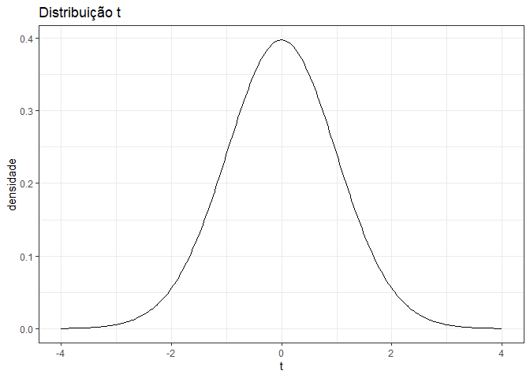
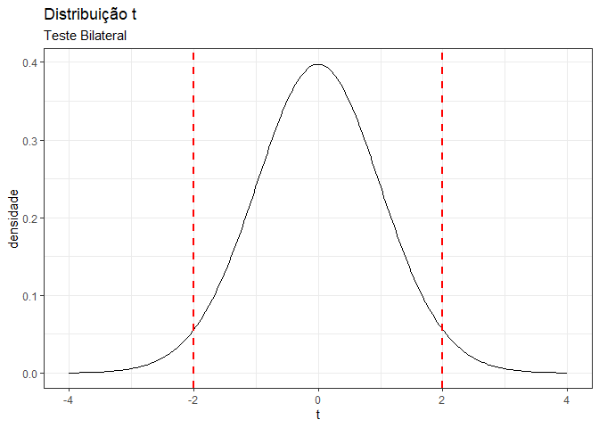
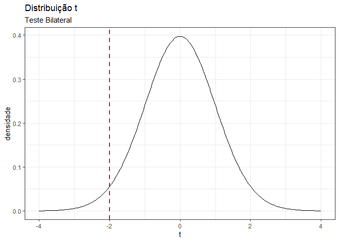
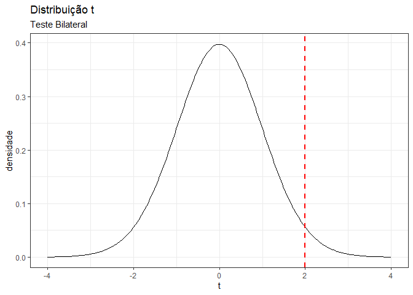
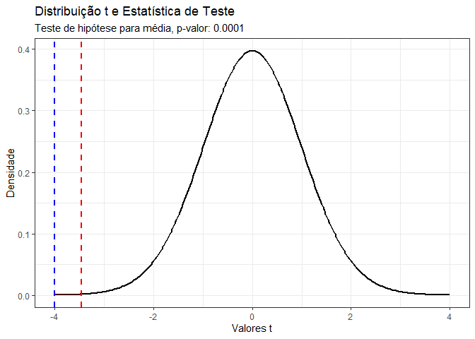
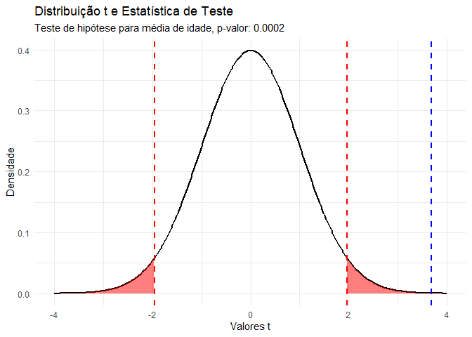
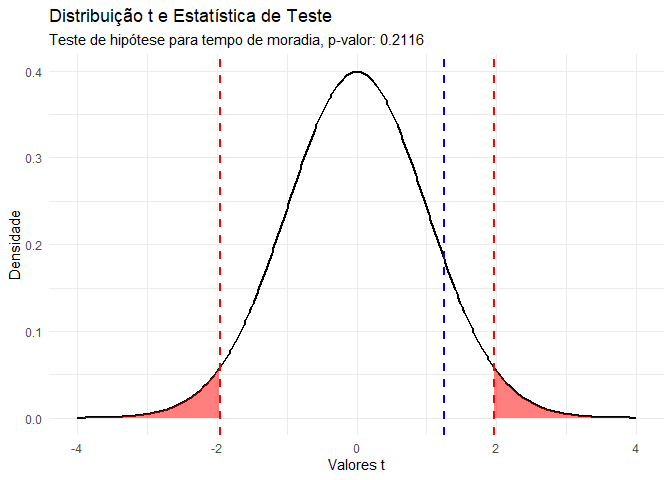
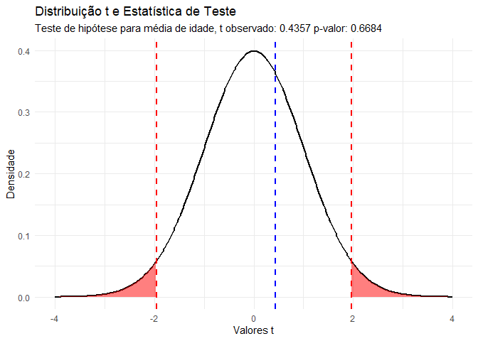
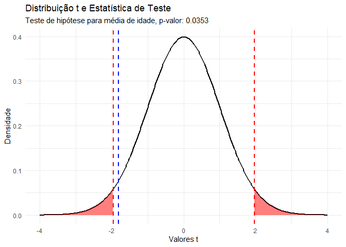

# Exerício 03

## Questão A

O gerente de controle de qualidade de uma fábrica de lâmpadas precisa
estimar a durabilidade média de uma nova remessa de lâmpadas.
Uma amostra aleatória de 64 lâmpadas foi selecionada nessa remessa e
indicou média de vida útil de 350 horas e desvio-padrão de 100 horas.

\   

### a) Entenda as etapas dos cálculos executadas abaixo.


```r
# Parâmetros da amostra
n <- 64  # Tamanho da amostra
x_hat <- 350  # Média amostral
sd <- 100  # Desvio padrão amostral
gamma <- 0.95 # Nivel de confiança
gl <- n - 1  # Graus de liberdade
```


```r
# apuração
gl <- n -1 
erro_padrao <- sd / sqrt(n)
var <- sd^2
alpha <- (1 - gamma)
t_alpha_meio <- qt( (1 - (alpha/2) ), gl)
m <- t_alpha_meio * erro_padrao
x_hat_menos_m <- x_hat - m 
x_hat_mais_m <-x_hat + m

# tabela
parametros <- c(n, x_hat, sd, gamma)
nomes_parametros <- c("Tamanho da Amostra (n)", "Média Amostral (x_hat)", "Desvio Padrão (sd)", "Nível de Confiança (gamma)")

apuracao <- c(gl, erro_padrao, var, alpha, t_alpha_meio, m, x_hat_menos_m, x_hat_mais_m)
nomes_apuracao <- c("Graus de Liberdade (gl)", "Erro Padrao (erro_padrao)", "Variância amostral (var)", "Nivel de Significancia(alpha)", "Valor crítico de t (t_alpha_meio)", "Margem de Erro (m)", "Limite Inferior do IC (x_hat_menos_m)", "Limite Superior do IC (x_hat_mais_m)")

# Combinando todos os valores e nomes em um dataframe
tabela <- data.frame(
  Variavel = c(nomes_parametros, nomes_apuracao),
  Valor = c(parametros, apuracao)
)

# Mostrando a tabela
print(tabela)
```

```
##                                 Variavel           Valor
## 1                 Tamanho da Amostra (n)    64.000000000
## 2                 Média Amostral (x_hat)   350.000000000
## 3                     Desvio Padrão (sd)   100.000000000
## 4             Nível de Confiança (gamma)     0.950000000
## 5                Graus de Liberdade (gl)    63.000000000
## 6              Erro Padrao (erro_padrao)    12.500000000
## 7               Variância amostral (var) 10000.000000000
## 8          Nivel de Significancia(alpha)     0.050000000
## 9      Valor crítico de t (t_alpha_meio)     1.998340543
## 10                    Margem de Erro (m)    24.979256782
## 11 Limite Inferior do IC (x_hat_menos_m)   325.020743218
## 12  Limite Superior do IC (x_hat_mais_m)   374.979256782
```


```r
# Criando uma sequência de valores t
t_values <- seq(-4, 4, length.out = 300)
# Criando um data frame para o ggplot
df_t <- data.frame(t = t_values, densidade = dt(t_values, gl))

# Calculando os valores t críticos para o nivel de confiança indicado nos parametros
t_crit_inf <- qt( ((1 - gamma) / 2), gl)  # Valor t para a cauda inferior
t_crit_sup <- qt(gamma + ((1 - gamma) / 2), gl)  # Valor t para a cauda superior

# Gráfico
t_plot <- ggplot(df_t, aes(x = t, y = densidade)) +
  geom_line(color = "black", size = 0.5) +
    labs(title = "Distribuição t") +
  theme_bw()
print(t_plot)
```

<!-- -->


```r
# bilateral
print(t_plot + 
        geom_vline(xintercept = t_crit_sup, color = "red", linetype = "dashed", linewidth = 1) +
        geom_vline(xintercept = t_crit_inf, color = "red", linetype = "dashed", linewidth = 1) +
        labs(subtitle = "Teste Bilateral")
      )
```

<!-- -->


```r
# unilateral esquerda
print(t_plot + 
        geom_vline(xintercept = t_crit_inf, color = "red", linetype = "dashed", linewidth = 1) +
        labs(subtitle = "Teste Unilateral à esquerda")
      )
```

<!-- -->


```r
# nilateral direita
print(t_plot + 
        geom_vline(xintercept = t_crit_sup, color = "red", linetype = "dashed", linewidth = 1) +
        labs(subtitle = "Teste Unilateral à direita")
      )
```

<!-- -->


\  

### b) Modifique a confiança e veja o que acontece com a precisão do intervalo.


```r
# Níveis de confiança para avaliar
confiancas <- c(0.90, 0.95, 0.99, 0.995, 0.999, 0.9995)

# Inicializar um data frame para os resultados
resultados <- data.frame(
  Confianca = numeric(),
  LimiteInferior = numeric(),
  LimiteSuperior = numeric()
)

# Cálculo dos intervalos de confiança para cada nível de confiança
for (confianca in confiancas) {
  alpha <- 1 - confianca
  t_alpha_meio <- qt(1 - alpha / 2, gl)
  erro_padrao <- sd / sqrt(n)
  m <- t_alpha_meio * erro_padrao
  limite_inferior <- x_hat - m
  limite_superior <- x_hat + m
  # Adicionar os resultados ao data frame
  resultados <- rbind(resultados, data.frame(Confianca = confianca,
                                             LimiteInferior = limite_inferior,
                                             LimiteSuperior = limite_superior,
                                             Intervalo = m))
}

# Mostrar a tabela
print(resultados)
```

```
##   Confianca LimiteInferior LimiteSuperior   Intervalo
## 1    0.9000    329.1324722    370.8675278 20.86752777
## 2    0.9500    325.0207432    374.9792568 24.97925678
## 3    0.9900    316.7981872    383.2018128 33.20181281
## 4    0.9950    313.6342223    386.3657777 36.36577770
## 5    0.9990    306.8528882    393.1471118 43.14711181
## 6    0.9995    304.1158826    395.8841174 45.88411739
```

\  

### c) Seria possível aceitar a reivindicação do fornecedor de que as lâmpadas duram 400 horas?

Para determinar se é possível aceitar a reivindicação do fornecedor de
que as lâmpadas duram em média 400 horas, podemos realizar um teste de
hipóteses com as seguintes hipóteses:

$H_0: μ = 400$ (hipótese nula: a média da população é 400 horas)\
$H_a: μ < 400$ (hipótese alternativa: a média da população é menor que 400
horas)

Considerando o nível de confiança de 95% e a média amostral de 350 horas
com desvio padrão de 100 horas para uma amostra de 64 lâmpadas, o teste
de hipóteses (unilateral à esquerda) pode ser conduzido da seguinte maneira:


```r
# parametro de teste
mu_0 <- 400

# Cálculo da estatística de teste (t)
t <- (x_hat - mu_0) / erro_padrao

# P-valor para o teste unicaudal à esquerda
p_valor <- pt(t, gl)

# Teste de hipótese
if (p_valor < alpha) {
  resultado <- "Rejeita H_0"
} else {
  resultado <- "Não rejeita H_0"
}

# Resultados
list(t = t, p_valor = p_valor, resultado = resultado)
```

```
## $t
## [1] -4
## 
## $p_valor
## [1] 0.00008452626054
## 
## $resultado
## [1] "Rejeita H_0"
```


```r
# Criar dados para o gráfico
x <- seq(-4, 4, length.out = 300)
df_t <- data.frame(x = x, y = dt(x, gl))

# Adicionar regiões críticas para UNILATERAL A ESQUERDA
critical_left <- qt(alpha, gl, lower.tail = TRUE)

# Gráfico
p <- ggplot(df_t, aes(x = x, y = y)) +
  geom_line(color = "black", size = 1) +
  geom_vline(xintercept = t, color = "blue", linetype = "dashed", linewidth = 1) +
  geom_vline(xintercept = critical_left, color = "red", linetype = "dashed", linewidth = 1) +
  geom_area(data = df_t %>% filter(x <= critical_left), aes(x = x, y = y), fill = "red", alpha = 0.5) +
    labs(title = "Distribuição t e Estatística de Teste",
       subtitle = paste("Teste de hipótese para média, p-valor:", round(p_valor, 4)),
       x = "Valores t", y = "Densidade") +
  theme_bw()

print(p)
```

<!-- -->

\  

## Questão B

### Dados


```r
# carregando o dataset
path = "C:/Users/DELL/OneDrive/R/Rprojetos/ufpr_ppgecon/estatistica/data/exerc3_dataset.csv"
dados <- read_csv2(path)
```

### Questão:

A planilha DEMO traz informações de 1.000 respondentes quanto à sua
idade em anos, o seu estado civil (1- casado , 0- não casado), quanto
tempo (em anos) vive no endereço atual, sua renda anual (em milhares de
reais), o preço do carro principal (em milhares de reais), sua
escolaridade (1- primeiro grau, 2- segundo grau, 3- terceiro grau, 4-
Pós graduação especialização, 5- mestrado/doutorado), 
quanto tempo, em anos, está no emprego atual (t_emp_atual), se é (1) ou
não (0) aposentado, o sexo (m- masc e f- femin) e sua satisfação no
trabalho (de 1- Nada satisfeito a 5- Muito satisfeito).

\  

#### Item 1

##### **a) Calcule um intervalo de confiança de $95%$ para a média de idade da população sob amostragem.**


```r
confianca_95 <- 0.95
error_padrao <- sd(dados$idade) / sqrt(nrow(dados))
margem_erro <- qt(1 - (1 - confianca_95) / 2, df = nrow(dados) - 1) * error_padrao
limite_inferior <- mean(dados$idade) - margem_erro
limite_superior <- mean(dados$idade) + margem_erro
c(limite_inferior, limite_superior)
```

```
## [1] 40.66239729 42.17760271
```

\  

##### **b) A mesma técnica utilizada no item anterior poderia ser usada para estimar a renda média populacional?**


```r
# A mesma técnica pode ser utilizada para qualquer variável quantitativa contínua.
```

\  

##### **c) Podemos estimar e interpretar intervalos de confiança da mesma forma que na letra "a" para a variável casados? E para a variável aposentado?**


```r
# Variável casados (est_civil) é binária, assim como aposentado. Usaremos uma proporção para o IC.
# Para casados
prop_casados <- mean(dados$est_civil)
se_casados <- sqrt(prop_casados * (1 - prop_casados) / nrow(dados))
me_casados <- qt(1 - (1 - gamma) / 2, df = nrow(dados) - 1) * se_casados
c(prop_casados - me_casados, prop_casados + me_casados)
```

```
## [1] 0.4799801667 0.5420198333
```

```r
# Para aposentados
prop_aposentado <- mean(dados$aposentado)
se_aposentado <- sqrt(prop_aposentado * (1 - prop_aposentado) / nrow(dados))
me_aposentado <- qt(1 - (1 - gamma) / 2, df = nrow(dados) - 1) * se_aposentado
c(prop_aposentado - me_aposentado, prop_aposentado + me_aposentado)
```

```
## [1] 0.02613537779 0.04986462221
```

\  

##### **d) Qual será a interpretação correta ao estimarmos um intervalo de 95% para a média dos casados?**


```r
# A interpretação seria a proporção de casados na população, com 95% de confiança.
# Isso não é uma média, mas sim uma proporção, portanto, o intervalo reflete a incerteza na estimativa da proporção de casados.
```

\  

##### **e) Calcule um intervalo de confiança de 90% para a média de tempo no emprego atual da população.**


```r
confianca_90 <- 0.90
error_padrao_emprego <- sd(dados$t_empr_atual) / sqrt(nrow(dados))
margem_erro_emprego <- qt(1 - (1 - confianca_90) / 2, df = nrow(dados) - 1) * error_padrao_emprego
limite_inferior_emprego <- mean(dados$t_empr_atual) - margem_erro_emprego
limite_superior_emprego <- mean(dados$t_empr_atual) + margem_erro_emprego
c(limite_inferior_emprego, limite_superior_emprego)
```

```
## [1]  9.936381613 10.949618387
```

\  

##### **f) Calcule um intervalo de confiança de 99% para a proporção de mulheres na população.**


```r
prop_mulheres <- mean(dados$sexo == "f")
se_mulheres <- sqrt(prop_mulheres * (1 - prop_mulheres) / nrow(dados))
confianca_99 <- 0.99
me_mulheres <- qt(1 - (1 - confianca_99) / 2, df = nrow(dados) - 1) * se_mulheres
c(prop_mulheres - me_mulheres, prop_mulheres + me_mulheres)
```

```
## [1] 0.4302632998 0.5117367002
```

\  

#### Item 2

Calcule o valor-p e decida se rejeita ou não a hipótese nula para cada
afirmação abaixo.
Adote o nível de significância de 5%.

\  

##### **a) A média de idade populacional é de 40 anos.**

$H_O:\mu = 40$   
$H_a:\mu \neq 40$ (teste bilateral)


```r
h_0_idade <- 40
t_teste_idade <- (mean(dados$idade) - h_0_idade) / (sd(dados$idade) / sqrt(nrow(dados)))
t_teste_idade
```

```
## [1] 3.678081992
```

```r
p_valor_idade <- 2 * pt(-abs(t_teste_idade), df = nrow(dados) - 1)
p_valor_idade
```

```
## [1] 0.0002475277697
```


```r
n <- nrow(dados)
df <- n - 1

# Criar dados para o gráfico
x <- seq(-4, 4, length.out = 300)
df_t <- data.frame(x = x, y = dt(x, df))

# Adicionar regiões críticas
critical_left <- qt(0.025, df, lower.tail = TRUE)
critical_right <- qt(0.025, df, lower.tail = FALSE)

# Gráfico
p <- ggplot(df_t, aes(x = x, y = y)) +
  geom_line(color = "black", size = 1) +
  geom_vline(xintercept = t_teste_idade, color = "blue", linetype = "dashed", linewidth = 1) +
  geom_vline(xintercept = critical_left, color = "red", linetype = "dashed", linewidth = 1) +
  geom_vline(xintercept = critical_right, color = "red", linetype = "dashed", linewidth = 1) +
  geom_area(data = df_t %>% filter(x <= critical_left), aes(x = x, y = y), fill = "red", alpha = 0.5) +
  geom_area(data = df_t %>% filter(x >= critical_right), aes(x = x, y = y), fill = "red", alpha = 0.5) +
  labs(title = "Distribuição t e Estatística de Teste",
       subtitle = paste("Teste de hipótese para média de idade, p-valor:", round(p_valor_idade, 4)),
       x = "Valores t", y = "Densidade") +
  theme_minimal()

print(p)
```

<!-- -->

\   

##### **b) A população sob amostragem vive, em média, 11 anos no mesmo endereço.**

$H_O:\mu = 11$  
$H_A: \mu \neq 11$


```r
h_0_endereco <- 11
t_teste_endereco <- (mean(dados$endereco) - h_0_endereco) / (sd(dados$endereco) / sqrt(nrow(dados)))
p_valor_endereco <- 2 * pt(-abs(t_teste_endereco), df = nrow(dados) - 1)

t_teste_endereco
```

```
## [1] 1.250052876
```

```r
p_valor_endereco
```

```
## [1] 0.2115729789
```


```r
n <- nrow(dados)
df <- n - 1

# Criar dados para o gráfico
x <- seq(-4, 4, length.out = 300)
df_t <- data.frame(x = x, y = dt(x, df))

# Adicionar regiões críticas
critical_left <- qt(0.025, df, lower.tail = TRUE)
critical_right <- qt(0.025, df, lower.tail = FALSE)

# Gráfico
p <- ggplot(df_t, aes(x = x, y = y)) +
  geom_line(color = "black", size = 1) +
  geom_vline(xintercept = t_teste_endereco, color = "blue", linetype = "dashed", linewidth = 1) +
  geom_vline(xintercept = critical_left, color = "red", linetype = "dashed", linewidth = 1) +
  geom_vline(xintercept = critical_right, color = "red", linetype = "dashed", linewidth = 1) +
  geom_area(data = df_t %>% filter(x <= critical_left), aes(x = x, y = y), fill = "red", alpha = 0.5) +
  geom_area(data = df_t %>% filter(x >= critical_right), aes(x = x, y = y), fill = "red", alpha = 0.5) +
  labs(title = "Distribuição t e Estatística de Teste",
       subtitle = paste("Teste de hipótese para tempo de moradia, p-valor:", round(p_valor_endereco, 4)),
       x = "Valores t", y = "Densidade") +
  theme_minimal()

print(p)
```

<!-- -->

\  

##### **c) Quais as chances de termos cometido um erro de decisão no item (a) e no item (b)?**


```r
# O nível de significância é a chance de erro tipo I (rejeitar H0 quando é verdadeira).
alfa <- 0.05
alfa
```

```
## [1] 0.05
```

\  

##### **d) A média de preço do carro principal das famílias nessa população está acima de R\$ 30.000,00.**

Se: 

$H_O:\mu = 30000$   
$H_a: \mu > 30000$ (teste unilateral à direita)

O teste t é:

$$
t = \frac{\bar{x}- \mu_0}{ \frac{s}{\sqrt{n}}} \text{, para } df = n-1\text{, } n < 30 \text{ e } \sigma \text{ desconhecido}
$$

\  

Apura-se:


```r
h_0_carro <- 30
t_teste_carro <- (mean(dados$carro) - h_0_carro) / (sd(dados$carro) / sqrt(nrow(dados)))
p_valor_carro <- pt(t_teste_carro, df = nrow(dados) - 1)

mean(dados$carro)
```

```
## [1] 30.3036
```

```r
sd(dados$carro)
```

```
## [1] 22.03292574
```

```r
t_teste_carro
```

```
## [1] 0.4357421746
```

```r
p_valor_carro
```

```
## [1] 0.6684410312
```

Dado que o p-valor é maior que o nível de significância, aceita-se
$H_0$, sugerindo que a média de preço do carro principal é
 que R\$ 30.000,00.


```r
n <- nrow(dados)
df <- n - 1

# Criar dados para o gráfico
x <- seq(-4, 4, length.out = 300)
df_t <- data.frame(x = x, y = dt(x, df))

# Adicionar regiões críticas
critical_left <- qt(0.025, df, lower.tail = TRUE)
critical_right <- qt(0.025, df, lower.tail = FALSE)

# Gráfico
p <- ggplot(df_t, aes(x = x, y = y)) +
  geom_line(color = "black", size = 1) +
  geom_vline(xintercept = t_teste_carro, color = "blue", linetype = "dashed", linewidth = 1) +
  geom_vline(xintercept = critical_left, color = "red", linetype = "dashed", linewidth = 1) +
  geom_vline(xintercept = critical_right, color = "red", linetype = "dashed", linewidth = 1) +
  geom_area(data = df_t %>% filter(x <= critical_left), aes(x = x, y = y), fill = "red", alpha = 0.5) +
  geom_area(data = df_t %>% filter(x >= critical_right), aes(x = x, y = y), fill = "red", alpha = 0.5) +
  labs(title = "Distribuição t e Estatística de Teste",
       subtitle = paste("Teste de hipótese para média de idade, t observado:", round(t_teste_carro,4), "p-valor:", round(p_valor_carro, 4)),
       x = "Valores t", y = "Densidade") +
  theme_minimal()

print(p)
```

<!-- -->

\  


##### **e) Em média, permanece-se menos de 11 anos no mesmo emprego.**

$H_O:\mu = 11$   
$H_a: \mu > 11$  (teste unilateral à direita)


```r
h_0_emprego <- 11
t_teste_emprego <- (mean(dados$t_empr_atual) - h_0_emprego) / (sd(dados$t_empr_atual) / sqrt(nrow(dados)))
p_valor_emprego <- pt(-abs(t_teste_emprego), df = nrow(dados) - 1)

t_teste_emprego
```

```
## [1] -1.810107718
```

```r
p_valor_emprego
```

```
## [1] 0.03528973248
```

Não é possível rejeitar $H_0$


```r
n <- nrow(dados)
df <- n - 1

# Criar dados para o gráfico
x <- seq(-4, 4, length.out = 300)
df_t <- data.frame(x = x, y = dt(x, df))

# Adicionar regiões críticas
critical_left <- qt(0.025, df, lower.tail = TRUE)
critical_right <- qt(0.025, df, lower.tail = FALSE)

# Gráfico
p <- ggplot(df_t, aes(x = x, y = y)) +
  geom_line(color = "black", size = 1) +
  geom_vline(xintercept = t_teste_emprego, color = "blue", linetype = "dashed", linewidth = 1) +
  geom_vline(xintercept = critical_left, color = "red", linetype = "dashed", linewidth = 1) +
  geom_vline(xintercept = critical_right, color = "red", linetype = "dashed", linewidth = 1) +
  geom_area(data = df_t %>% filter(x <= critical_left), aes(x = x, y = y), fill = "red", alpha = 0.5) +
  geom_area(data = df_t %>% filter(x >= critical_right), aes(x = x, y = y), fill = "red", alpha = 0.5) +
  labs(title = "Distribuição t e Estatística de Teste",
       subtitle = paste("Teste de hipótese para média de idade, p-valor:", round(p_valor_emprego, 4)),
       x = "Valores t", y = "Densidade") +
  theme_minimal()

print(p)
```

<!-- -->

\  

##### **f) Metade da população é casada.**

Se:

$H_0: p_0 = 0.5$  
$H_a: p_0 \neq 0.5$ (bilateral)

Sendo que o teste T é calculado com:
$$
t = \frac{\hat{p} - p_0} {SE}
$$  

\  

Apura-se:

```r
h_0_casados <- 0.5
prop_casados <- mean(dados$est_civil)  # Calcular a proporção de casados na amostra
n <- nrow(dados)  # Número de observações na amostra
se_casados <- sqrt(prop_casados * (1 - prop_casados) / n)  # Calcular o erro padrão da proporção
t_teste_casados <- (prop_casados - h_0_casados) / se_casados # Calcular a estatística T
p_valor_casados <- 2 * pt(-abs(t_teste_casados), df = n - 1) # Calcular o p-valor para um teste bilateral

prop_casados
```

```
## [1] 0.511
```

```r
se_casados
```

```
## [1] 0.01580756148
```

```r
t_teste_casados
```

```
## [1] 0.695869506
```

```r
p_valor_casados
```

```
## [1] 0.4866724058
```

Não rejeita-se $H_0$
