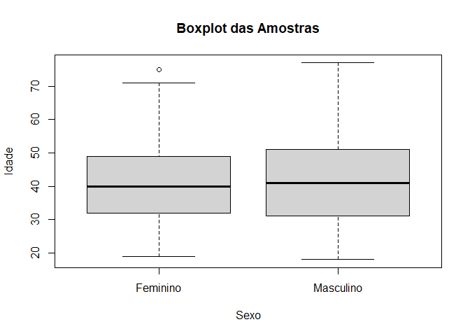
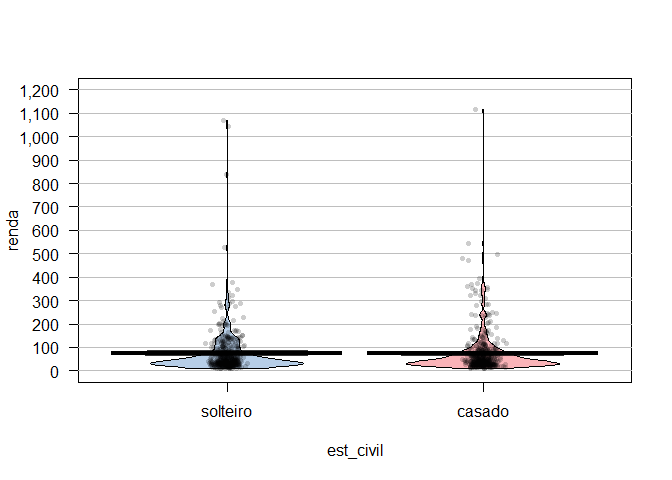
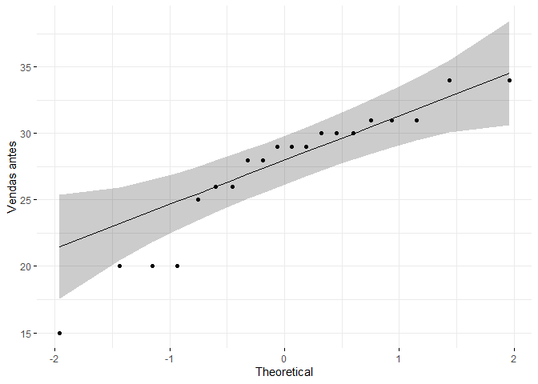

# Exerício 04

## Questão A

A planilha DEMO traz informações de 1.000 respondentes quanto à sua idade em anos, 
o seu estado civil (1- casado , 0- não casado), quanto tempo (em anos) vive no endereço atual,
sua renda anual (em milhares de reais), o preço do carro principal (em milhares de reais),
sua escolaridade (1- primeiro grau, 2- segundo grau, 3- terceiro grau, 4- Pós graduação especialização, 
5- mestrado/doutorado),  quanto tempo, em anos, está no emprego atual (t_emp_atual),
se é (1) ou não (0) aposentado, o sexo (m- masc e f- femin) e sua satisfação
no trabalho (de 1- Nada satisfeito a 5- Muito satisfeito).


```r
# carregando o dataset
path_a = here("./estatistica/data/dataset4a.csv")
dfa <- read_csv2(path_a,
                   col_types = cols(
                     sexo = col_factor(levels = c("f", "m"))  # Especifica os níveis 'f' e 'm'
                   )
                 )

# ajustando variaveis qualitativas ordinais como factor
dfa$est_civil <- factor(dfa$est_civil, levels = c(0, 1), labels = c("solteiro", "casado"))
dfa$sexo <- factor(dfa$sexo, levels = c("f", "m"), labels = c("fem", "masc"))

# checking
head(dfa)
```

```
## # A tibble: 6 × 11
##   idade est_civil endereco renda carro escolaridade t_empr_atual aposentado
##   <dbl> <fct>        <dbl> <dbl> <dbl>        <dbl>        <dbl>      <dbl>
## 1    55 casado          12    72  36.2            1           23          0
## 2    56 solteiro        29   153  76.9            1           35          0
## 3    28 casado           9    28  13.7            3            4          0
## 4    24 casado           4    26  12.5            4            0          0
## 5    25 solteiro         2    23  11.3            2            5          0
## 6    45 casado           9    76  37.2            3           13          0
## # ℹ 3 more variables: satisf_trabal <dbl>, sexo <fct>, acima10anos <dbl>
```

```r
# cleaning
rm(path_a)
```

\  

### a) Teste se as médias de idade entre homens e mulheres da população podem ser consideradas iguais usando o teste-t presumindo variâncias iguais e depois presumindo-as diferentes. Qual seria o valor-p mais correto nesse caso?

Considerando que são amostras independentes, o teste $t$ de Student pode ser utilizado para comparar as médias dos dois grupos.  
\  

A fórmula do teste t é dada por:

$$ 
t = \frac{\bar{X}_1 - \bar{X}_2}{\sqrt{s_p^2\left(\frac{1}{n_1} + \frac{1}{n_2}\right)}}
$$

Onde:  
- $\bar{X}_1$ e $\bar{X}_2$ são as médias amostrais dos grupos;  
- $n_1$ e $n_2$ são os tamanhos das amostras; e  
- $s_p^2$ é a variância combinada das duas amostras quando assumimos variâncias iguais.     

\  


Primeiro, verifica-se a homogeneidade das variâncias, considerando:

$H_0$ : as variâncias são homogeneas  
$H_a$ : as variâncias não são homogêneas


```r
# Teste de levene 
levene_teste_4aa <- leveneTest(idade ~ sexo, data = dfa)
levene_teste_4aa
```

```
## Levene's Test for Homogeneity of Variance (center = median)
##        Df F value  Pr(>F)
## group   1 2.26378 0.13275
##       998
```

```r
# Gráfico de boxplot
with(dfa, boxplot(idade ~ sexo, names = c("Feminino", "Masculino"), 
                  xlab = "Sexo", ylab = "Idade", main = "Boxplot das Amostras"))
```

<!-- -->

Dado que o p-valor do teste Levene ficou acima de 5%, não é possível rejeitar $H_0$, portanto, aceita-se que há homogeneidade entre as variancias.    


```r
# Primeiro, separamos os dados por sexo
homens <- filter(dfa, sexo == "masc")
mulheres <- filter(dfa, sexo == "fem")

# Realizando o teste t com variâncias iguais (parametro var.equal = TRUE)
t_test_var_iguais <- t.test(idade ~ sexo, data = dfa, var.equal = TRUE)
print(t_test_var_iguais)
```

```
## 
## 	Two Sample t-test
## 
## data:  idade by sexo
## t = -0.69941998, df = 998, p-value = 0.4844526
## alternative hypothesis: true difference in means between group fem and group masc is not equal to 0
## 95 percent confidence interval:
##  -2.0592507267  0.9770502041
## sample estimates:
##  mean in group fem mean in group masc 
##        41.13375796        41.67485822
```

\  

De outro lado, presumindo as variâncias diferentes, utiliza-se o teste Welch:  


```r
# Realizando o teste t com variâncias diferentes (padrão)
t_test_var_diferentes <- t.test(idade ~ sexo, data = dfa, var.equal = FALSE)
print(t_test_var_diferentes)
```

```
## 
## 	Welch Two Sample t-test
## 
## data:  idade by sexo
## t = -0.70092346, df = 991.76175, p-value = 0.4835152
## alternative hypothesis: true difference in means between group fem and group masc is not equal to 0
## 95 percent confidence interval:
##  -2.0560058602  0.9738053376
## sample estimates:
##  mean in group fem mean in group masc 
##        41.13375796        41.67485822
```


\  

Pelos testes realizados, é possível afirmar que, estatisticamente, a variância das idades é igual
para os dois grupos (homens e mulheres).  
Portanto, o correto é considerar o p-valor do teste t, para variâncias iguais,
o qual é 0.4844525831.


\  

### b) Quem possui maior renda, os casados ou não casados?

Para avaliar se existe uma diferença estatística significativa na renda entre indivíduos casados e solteiros, realizaremos um teste t de Student para amostras independentes.   
Este teste é adequado pois estamos comparando as médias de dois grupos distintos.

**Hipóteses**:  
- $H_0$: Não há diferença nas médias de renda entre casados e solteiros.  
- $H_a$: Existe uma diferença nas médias de renda entre casados e solteiros.

\  

Primeiro, verifica-se se há igualdade de variância entre os dois grupos:


```r
# Aplicando o Teste de Levene para verificar a igualdade das variâncias
levene_test <- leveneTest(renda ~ est_civil, data = dfa)

# Verificando a estrutura do resultado do Teste de Levene
print(summary(levene_test))
```

```
##        Df            F value               Pr(>F)         
##  Min.   :  1.00   Min.   :0.05897461   Min.   :0.8081739  
##  1st Qu.:250.25   1st Qu.:0.05897461   1st Qu.:0.8081739  
##  Median :499.50   Median :0.05897461   Median :0.8081739  
##  Mean   :499.50   Mean   :0.05897461   Mean   :0.8081739  
##  3rd Qu.:748.75   3rd Qu.:0.05897461   3rd Qu.:0.8081739  
##  Max.   :998.00   Max.   :0.05897461   Max.   :0.8081739  
##                   NA's   :1            NA's   :1
```

```r
str(levene_test)
```

```
## Classes 'anova' and 'data.frame':	2 obs. of  3 variables:
##  $ Df     : int  1 998
##  $ F value: num  0.059 NA
##  $ Pr(>F) : num  0.808 NA
##  - attr(*, "heading")= chr "Levene's Test for Homogeneity of Variance (center = median)"
```

```r
# yarr pirateplot
yarrr::pirateplot(formula = renda ~ est_civil, data = dfa)
```

<!-- -->


```r
# Agrupamos por estado civil e calculamos a média de renda
media_renda_est_civil <- dfa %>%
  group_by(est_civil) %>%
  summarise(media_renda = mean(renda))

# Exibindo os resultados
print(media_renda_est_civil)
```

```
## # A tibble: 2 × 2
##   est_civil media_renda
##   <fct>           <dbl>
## 1 solteiro         73.1
## 2 casado           72.7
```


```r
# Aplicando o Teste de Levene para verificar a igualdade das variâncias
levene_test <- leveneTest(renda ~ est_civil, data = dfa)

# Verificando a estrutura do resultado do Teste de Levene
print(summary(levene_test))
```

```
##        Df            F value               Pr(>F)         
##  Min.   :  1.00   Min.   :0.05897461   Min.   :0.8081739  
##  1st Qu.:250.25   1st Qu.:0.05897461   1st Qu.:0.8081739  
##  Median :499.50   Median :0.05897461   Median :0.8081739  
##  Mean   :499.50   Mean   :0.05897461   Mean   :0.8081739  
##  3rd Qu.:748.75   3rd Qu.:0.05897461   3rd Qu.:0.8081739  
##  Max.   :998.00   Max.   :0.05897461   Max.   :0.8081739  
##                   NA's   :1            NA's   :1
```

```r
str(levene_test)
```

```
## Classes 'anova' and 'data.frame':	2 obs. of  3 variables:
##  $ Df     : int  1 998
##  $ F value: num  0.059 NA
##  $ Pr(>F) : num  0.808 NA
##  - attr(*, "heading")= chr "Levene's Test for Homogeneity of Variance (center = median)"
```

```r
# Checando se o p-value está disponível e usando corretamente
if (!is.na(levene_test$'Pr(>F)'[1])) {
  if (levene_test$'Pr(>F)'[1] > 0.05) {
    t_test_result <- t.test(renda ~ est_civil, data = dfa, var.equal = TRUE)
  } else {
    t_test_result <- t.test(renda ~ est_civil, data = dfa, var.equal = FALSE)
  }
} else {
  print("P-value não disponível ou NA, verifique os dados ou a aplicação do teste.")
}

# Exibindo o resultado do teste t, se disponível
if (exists("t_test_result")) {
  print(t_test_result)
}
```

```
## 
## 	Two Sample t-test
## 
## data:  renda by est_civil
## t = 0.060594548, df = 998, p-value = 0.9516942
## alternative hypothesis: true difference in means between group solteiro and group casado is not equal to 0
## 95 percent confidence interval:
##  -11.24384585  11.96036064
## sample estimates:
## mean in group solteiro   mean in group casado 
##            73.09406953            72.73581213
```

\  

### c) Verifique a afirmação que a proporção de aposentados masculinos da população é maior que a proporção do sexo feminino.


```r
# Calculamos a proporção de aposentados por sexo
prop_aposentados_sexo <- dfa %>%
  group_by(sexo) %>%
  summarise(prop_aposentados = mean(aposentado == 1))

# Exibindo os resultados
print(prop_aposentados_sexo)
```

```
## # A tibble: 2 × 2
##   sexo  prop_aposentados
##   <fct>            <dbl>
## 1 fem             0.0255
## 2 masc            0.0491
```


\  

### d) A diferença entre a renda anual média populacional das pessoas que estão a mais de 10 anos no emprego atual e as que não estão é superior a R$ 70.000,00?


```r
library(dplyr)

# Preparando os dados
grupo_maior_10_anos <- dfa %>%
  filter(acima10anos == 1) %>%
  pull(renda)

grupo_menor_10_anos <- dfa %>%
  filter(acima10anos == 0) %>%
  pull(renda)

# Realizando o teste t para comparar as médias
t_test_result <- t.test(grupo_maior_10_anos, grupo_menor_10_anos, alternative = "greater")

# Exibindo os resultados do teste t
print(t_test_result)
```

```
## 
## 	Welch Two Sample t-test
## 
## data:  grupo_maior_10_anos and grupo_menor_10_anos
## t = 12.352815, df = 406.07885, p-value < 2.2204e-16
## alternative hypothesis: true difference in means is greater than 0
## 95 percent confidence interval:
##  72.17341286         Inf
## sample estimates:
##    mean of x    mean of y 
## 123.88402062  40.59477124
```

\  


## Questão B

Um novo veículo de propaganda está em fase de teste na área de Marketing da empresa.
Para testar se o investimento nesse veículo de propaganda causa um real impacto nas vendas,
dados de vendas (em milhares de unidades do produto) para 20 clientes aleatoriamente 
selecionados foram levantados, antes e depois da nova publicidade ter sido iniciada. 
A planilha vendas apresenta os dados em questão.
\  


```r
# carregando o dataset
path_b = here("./estatistica/data/dataset4b.csv")
dfb <- read_csv2(path_b)
head(dfb)
```

```
## # A tibble: 6 × 2
##   `Vendas-ant` `Vendas-dep`
##          <dbl>        <dbl>
## 1           30           29
## 2           28           30
## 3           31           32
## 4           26           30
## 5           20           16
## 6           30           25
```

```r
rm(path_b)
```

\  


```r
sumtable(dfb)
```

<table class="table" style="color: black; margin-left: auto; margin-right: auto;">
<caption>Summary Statistics</caption>
 <thead>
  <tr>
   <th style="text-align:left;"> Variable </th>
   <th style="text-align:left;"> N </th>
   <th style="text-align:left;"> Mean </th>
   <th style="text-align:left;"> Std. Dev. </th>
   <th style="text-align:left;"> Min </th>
   <th style="text-align:left;"> Pctl. 25 </th>
   <th style="text-align:left;"> Pctl. 75 </th>
   <th style="text-align:left;"> Max </th>
  </tr>
 </thead>
<tbody>
  <tr>
   <td style="text-align:left;"> Vendas-ant </td>
   <td style="text-align:left;"> 20 </td>
   <td style="text-align:left;"> 27 </td>
   <td style="text-align:left;"> 5 </td>
   <td style="text-align:left;"> 15 </td>
   <td style="text-align:left;"> 26 </td>
   <td style="text-align:left;"> 30 </td>
   <td style="text-align:left;"> 34 </td>
  </tr>
  <tr>
   <td style="text-align:left;"> Vendas-dep </td>
   <td style="text-align:left;"> 20 </td>
   <td style="text-align:left;"> 29 </td>
   <td style="text-align:left;"> 4.7 </td>
   <td style="text-align:left;"> 16 </td>
   <td style="text-align:left;"> 28 </td>
   <td style="text-align:left;"> 32 </td>
   <td style="text-align:left;"> 34 </td>
  </tr>
</tbody>
</table>

Checando a normalidade  
Teste Shapiro-Wilk:
- $H_0$ : os dados tem distribuição normal  
- $H_a$ : os dados não tem distribuição normal  


```r
ci <- 0.95
sw_test1 <- shapiro.test(dfb$`Vendas-ant`)
sw_test1
```

```
## 
## 	Shapiro-Wilk normality test
## 
## data:  dfb$`Vendas-ant`
## W = 0.89196234, p-value = 0.02922598
```

```r
paste("Rejeita-se H_0:", ci > sw_test1$p.value)
```

```
## [1] "Rejeita-se H_0: TRUE"
```

```r
sw_test2 <- shapiro.test(dfb$`Vendas-dep`)
sw_test2
```

```
## 
## 	Shapiro-Wilk normality test
## 
## data:  dfb$`Vendas-dep`
## W = 0.81545287, p-value = 0.001482474
```

```r
paste("Rejeita-se H_0:", ci > sw_test2$p.value)
```

```
## [1] "Rejeita-se H_0: TRUE"
```


```r
ggqqplot(dfb$`Vendas-ant`, ylab = "Vendas antes",
         ggtheme = theme_minimal())
```

<!-- -->


### a) Pode-se concluir que o novo veículo de propaganda é eficiente para aumentar as vendas?
\  

Para apurar se o novo veículo é eficiente, pode-se usar um teste pareado, conforme:

$$
t = \frac
{\bar{x_d}}
{ \frac
  {s_d}
  {\sqrt{n}}
}
$$
Onde:  
- $\bar{d}$ é a diferença da média nas observações paredas
- $s_d$ é a diferença do desvio padrão
- $n$ é o numero de pares

Apura-se:

```r
# Realizar o teste t pareado
t_test_pareado <- t.test(dfb$`Vendas-dep`, dfb$`Vendas-ant`, paired = TRUE, alternative = "greater")
t_test_pareado
```

```
## 
## 	Paired t-test
## 
## data:  dfb$`Vendas-dep` and dfb$`Vendas-ant`
## t = 2.0244086, df = 19, p-value = 0.02860853
## alternative hypothesis: true mean difference is greater than 0
## 95 percent confidence interval:
##  0.2114938332          Inf
## sample estimates:
## mean difference 
##            1.45
```

Este código realiza um teste t para amostras pareadas assumindo que a hipótese alternativa é que as vendas antes são maiores que as vendas depois (i.e., a propaganda não é eficaz). 

\  

O p-valor encontrado (0.0286085347) indica que é possível rejeitar $H_0$.   
Ou seja, é possível assumir que a propaganda é eficáz, dado que as vendas posteriores são maiores.


\  

### b) Qual a premissa para a aplicação do teste no item (a)?
\  

As premissas adotadas são que as 
Cada par de observação foi extraído do mesmo sujeito.
As diferenças tem distribuição normal.


```r
# Calcular as diferenças
diferencas <- dfb$`Vendas-dep` - dfb$`Vendas-ant`
hist(diferencas)
```

<!-- -->

```r
x_d <- mean(diferencas)
x_d
```

```
## [1] 1.45
```

```r
se <- sd(diferencas)/sqrt(length((diferencas)))
se
```

```
## [1] 0.7162585537
```

```r
t <- x_d / se
t
```

```
## [1] 2.024408634
```

```r
# Testar a normalidade das diferenças
shapiro_test <- shapiro.test(diferencas)
shapiro_test
```

```
## 
## 	Shapiro-Wilk normality test
## 
## data:  diferencas
## W = 0.95386828, p-value = 0.4296392
```

Este código calcula as diferenças entre as vendas antes e depois e aplica o teste de Shapiro-Wilk para normalidade

\  

### c) Imagine que só seria vantajoso o investimento nesse novo veículo de propaganda se as vendas subissem mais de mil unidades em média. Qual seria sua decisão nesse caso?


```r
# Calcular a diferença média das vendas e verificar se é maior que 1 (mil unidades em milhares)
media_diferencas <- mean(diferencas)
decisao <- media_diferencas > 1  # 1 representa mil unidades

# Exibir decisão
print(media_diferencas)
```

```
## [1] 1.45
```

```r
print(decisao)
```

```
## [1] TRUE
```


Este código calcula a média das diferenças entre as vendas antes e depois e verifica se esta média é maior que 1 (equivalente a mil unidades, já que os dados estão em milhares).
